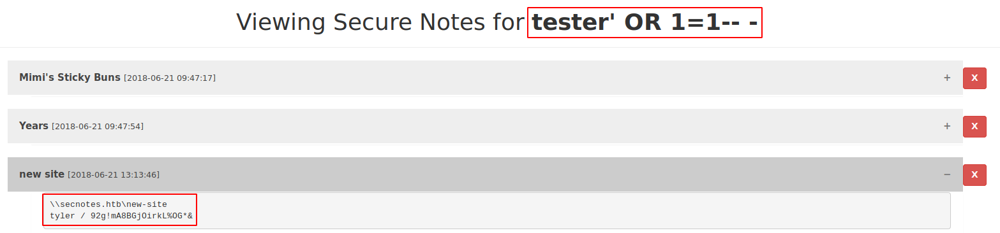

# Alternative way to exploit SecNotes

## SQL Injection vulnerability

Instead of abusing the **CSRF** vulnerability, there is a **SQL Injection** vulnerability in the web application.

Creating a user with a basic SQL Injection string:
```markdown
Username:
tester' OR 1=1-- -
```

The password can be anything and after logging in with the user _"tester' OR 1=1-- -"_ and the given password, it logs us in successfully and we see all notes:



## Getting Administrator without bash

If the `bash` on Windows command makes trouble, then there is another way to find the _.bash_history_ file.

The installation and all files of the _"bash on Windows"_ can be found in the following path:
```markdown
C:\Users\tyler\appdata\local\Packages\CanonicalGroupLimited.Ubuntu18.04onWindows_79rhkp1fndgsc\LocalState\rootfs\root
```
